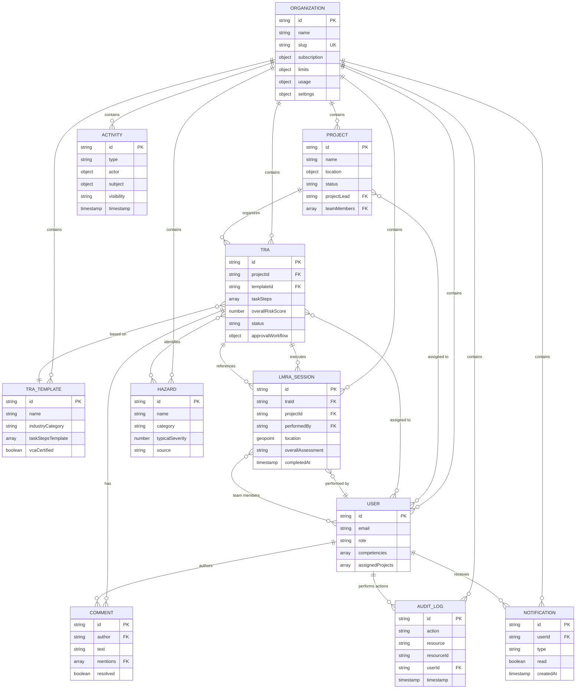

# SafeWork Pro - Firestore Data Model Documentation
## Multi-Tenant TRA/LMRA System

**Version**: 1.0  
**Last Updated**: September 29, 2025  
**Status**: Foundation Design Complete  
**Related Documents**: [FEATURE_REQUIREMENTS.md](FEATURE_REQUIREMENTS.md:1), [PROJECT_MEMORY.md](PROJECT_MEMORY.md:1)

---

## Table of Contents

1. [Overview](#overview)
2. [Multi-Tenant Architecture](#multi-tenant-architecture)
3. [Collection Schemas](#collection-schemas)
4. [Data Relationships](#data-relationships)
5. [Security Rules](#security-rules)
6. [Indexes](#indexes)
7. [Data Migration & Versioning](#data-migration--versioning)
8. [Performance Considerations](#performance-considerations)
9. [Backup & Recovery](#backup--recovery)

---

## Overview

### Design Principles

**1. Multi-Tenant Isolation**
- Complete data separation between organizations
- All collections scoped under `organizations/{orgId}/`
- Security rules enforce organization context from auth token

**2. NoSQL Denormalization Strategy**
- Embed frequently accessed data to minimize reads
- Duplicate data strategically for query performance
- Balance between normalization and read efficiency

**3. Scalability & Performance**
- Collections designed for 10,000+ documents per organization
- Composite indexes for common query patterns
- Pagination support (50-100 items per page)

**4. Real-time Collaboration**
- Firestore listeners for live updates
- Optimistic locking for concurrent edits
- Presence tracking for active users

**5. Audit Trail & Compliance**
- Immutable audit logs for all critical operations
- Comprehensive change tracking for TRAs
- VCA compliance documentation support

---

## Multi-Tenant Architecture

### Authentication & Authorization

```typescript
// Firebase Auth Custom Claims
interface CustomClaims {
  orgId: string;           // Organization ID for multi-tenant isolation
  role: 'admin' | 'safety_manager' | 'supervisor' | 'field_worker';
  permissions?: string[];  // Future: custom permissions
}

// Example token payload
{
  uid: "user123",
  email: "john@example.com",
  orgId: "org_abc123",
  role: "safety_manager",
  iat: 1234567890,
  exp: 1234571490  // 1 hour expiry
}
```

### Organization Context Enforcement

All Firestore queries MUST include organization context from auth token:
```typescript
// ✅ CORRECT - Organization scoped
const trasRef = db.collection(`organizations/${orgId}/tras`);

// ❌ WRONG - Cross-organization access possible
const trasRef = db.collection('tras');
```

Security rules validate `orgId` from custom claims matches document path.

---

## Collection Schemas

### 1. Organizations Collection

**Path**: `organizations/{orgId}`

Root collection for multi-tenant data. Each organization is completely isolated.

```typescript
interface Organization {
  // Identity
  id: string;                    // Auto-generated document ID
  name: string;                  // Organization name
  slug: string;                  // URL-friendly identifier (unique)
  
  // Business Information
  industry: 'construction' | 'industrial' | 'offshore' | 'logistics' | 'other';
  country: string;               // ISO country code (NL, BE, DE, etc.)
  language: 'nl' | 'en';         // Primary language
  
  // Subscription & Billing
  subscription: {
    tier: 'starter' | 'professional' | 'enterprise';
    status: 'trial' | 'active' | 'past_due' | 'canceled' | 'paused';
    startDate: Timestamp;
    currentPeriodEnd: Timestamp;
    stripeCustomerId?: string;   // Stripe customer ID
    stripeSubscriptionId?: string;
  };
  
  // Usage Limits (based on subscription tier)
  limits: {
    maxUsers: number;            // e.g., 10, 50, unlimited
    maxProjects: number;         // e.g., 5, 25, unlimited
    maxTRAs: number;             // e.g., 100, 500, unlimited
    maxStorageGB: number;        // e.g., 10, 50, 500
  };
  
  // Current Usage
  usage: {
    userCount: number;
    projectCount: number;
    traCount: number;
    storageGB: number;
    lastUpdated: Timestamp;
  };
  
  // Settings
  settings: {
    // TRA Settings
    defaultTRAValidityMonths: number;  // Default 6, max 12 per VCA
    approvalWorkflow: 'simple' | 'standard' | 'enterprise';
    requireDigitalSignatures: boolean;
    
    // LMRA Settings
    requireGPSVerification: boolean;
    requirePhotoDocumentation: boolean;
    allowOfflineExecution: boolean;
    
    // Notifications
    emailNotifications: boolean;
    pushNotifications: boolean;
    
    // Compliance
    complianceFramework: 'vca' | 'iso45001' | 'both';
    enableAuditLog: boolean;
  };
  
  // Branding
  branding?: {
    logoURL?: string;            // Cloud Storage URL
    primaryColor?: string;       // Hex color
    accentColor?: string;
  };
  
  // Metadata
  createdBy: string;             // User ID of creator
  createdAt: Timestamp;
  updatedAt: Timestamp;
  isActive: boolean;             // Soft delete flag
}
```

**Indexes Required**:
- `slug` (unique, for vanity URLs)
- `subscription.status` (for billing queries)
- `createdAt` (for sorting)

---

### 2. Users Subcollection

**Path**: `organizations/{orgId}/users/{userId}`

User profiles within an organization. userId matches Firebase Auth UID.

```typescript
interface User {
  // Identity (from Firebase Auth)
  id: string;                    // Firebase Auth UID
  email: string;
  displayName: string;
  photoURL?: string;
  
  // Profile
  firstName: string;
  lastName: string;
  phoneNumber?: string;
  
  // Role & Permissions
  role: 'admin' | 'safety_manager' | 'supervisor' | 'field_worker';
  roleAssignedAt: Timestamp;
  roleAssignedBy: string;        // User ID
  
  // Project Assignment
  projectAccess: 'all' | 'assigned';  // All projects or specific ones
  assignedProjects?: string[];   // Project IDs (if projectAccess = 'assigned')
  
  // Competencies & Certifications
  competencies: {
    id: string;                  // Competency ID
    name: string;                // e.g., "VCA Basic Safety"
    authority: string;           // Issuing authority
    certificateNumber?: string;
    issueDate: Timestamp;
    expiryDate: Timestamp;
    status: 'valid' | 'expiring_soon' | 'expired';
    certificateFileURL?: string; // Cloud Storage URL
  }[];
  
  // Activity Tracking
  lastLoginAt: Timestamp;
  lastActiveAt: Timestamp;
  loginCount: number;
  
  // Preferences
  preferences?: {
    language: 'nl' | 'en';
    timezone: string;
    emailNotifications: boolean;
    pushNotifications: boolean;
  };
  
  // Metadata
  invitedBy?: string;            // User ID of inviter
  invitedAt?: Timestamp;
  acceptedInviteAt?: Timestamp;
  createdAt: Timestamp;
  updatedAt: Timestamp;
  isActive: boolean;             // Soft delete / deactivation
}
```

**Indexes Required**:
- `email` (for lookup)
- `role` (for role-based queries)
- `isActive` (for filtering active users)
- Composite: `projectAccess + assignedProjects` (for project filtering)

---

### 3. Projects Subcollection

**Path**: `organizations/{orgId}/projects/{projectId}`

Projects organize TRAs and team assignments.

```typescript
interface Project {
  // Identity
  id: string;                    // Auto-generated
  name: string;
  description?: string;
  
  // Location
  location: {
    address: string;
    city: string;
    postalCode?: string;
    country: string;
    coordinates?: GeoPoint;      // For GPS verification
  };
  
  // Timeline
  status: 'planning' | 'active' | 'on_hold' | 'completed' | 'archived';
  startDate: Timestamp;
  endDate?: Timestamp;
  expectedDuration?: number;     // Days
  
  // Client Information
  client?: {
    name: string;
    contactPerson?: string;
    email?: string;
    phone?: string;
  };
  
  // Team
  projectLead: string;           // User ID
  teamMembers: string[];         // User IDs
  
  // Statistics (denormalized for dashboard)
  stats: {
    traCount: number;
    activeTRACount: number;
    lmraCount: number;
    averageRiskScore: number;
    lastUpdated: Timestamp;
  };
  
  // Settings
  settings?: {
    requireLMRAForAllWork: boolean;
    allowGuestAccess: boolean;   // For external contractors
  };
  
  // Metadata
  createdBy: string;
  createdAt: Timestamp;
  updatedAt: Timestamp;
  archivedAt?: Timestamp;
}
```

**Indexes Required**:
- `status` (for filtering)
- `startDate` (for sorting)
- Composite: `status + startDate` (for active projects)

---

### 4. TRA Templates Subcollection

**Path**: `organizations/{orgId}/traTemplates/{templateId}`

Reusable TRA templates for common scenarios. Includes both system-provided and organization-specific templates.

```typescript
interface TRATemplate {
  // Identity
  id: string;
  name: string;
  description: string;
  
  // Classification
  industryCategory: 'construction' | 'industrial' | 'offshore' | 'logistics' | 'other';
  hazardCategories: string[];    // e.g., ['electrical', 'working_at_height']
  
  // Compliance
  complianceFramework: 'vca' | 'iso45001' | 'both';
  vcaCertified: boolean;
  vcaVersion?: string;           // e.g., "VCA 2017 v5.1"
  certificationDate?: Timestamp;
  
  // Template Content
  taskStepsTemplate: {
    stepNumber: number;
    description: string;
    duration?: number;           // Minutes
    requiredPersonnel?: number;
    
    // Pre-configured hazards
    hazards: {
      description: string;
      category: string;
      typicalEffect: number;     // Kinney & Wiruth Effect score
      typicalExposure: number;   // Exposure score
      typicalProbability: number; // Probability score
      
      // Recommended control measures
      recommendedControls: {
        type: 'elimination' | 'substitution' | 'engineering' | 'administrative' | 'ppe';
        description: string;
        priority: number;        // 1-5, lower is higher priority
      }[];
    }[];
  }[];
  
  // Required Competencies
  requiredCompetencies?: string[]; // Competency names
  
  // Template Metadata
  version: number;               // Version control
  isSystemTemplate: boolean;     // System vs organization template
  isPublished: boolean;          // Available for use
  usageCount: number;            // Track popularity
  
  // Ownership
  createdBy: string;
  createdAt: Timestamp;
  updatedAt: Timestamp;
  lastUsedAt?: Timestamp;
}
```

**Indexes Required**:
- `industryCategory` (for filtering)
- `vcaCertified` (for filtering)
- Composite: `isPublished + industryCategory` (for template selection)

---

### 5. TRAs Subcollection

**Path**: `organizations/{orgId}/tras/{traId}`

Task Risk Analysis documents - the core of the system.

```typescript
interface TRA {
  // Identity
  id: string;
  title: string;
  description?: string;
  
  // Relationships
  projectId: string;
  templateId?: string;           // Source template (if used)
  
  // Task Breakdown
  taskSteps: {
    stepNumber: number;
    description: string;
    duration?: number;           // Minutes
    requiredPersonnel?: number;
    location?: string;
    
    // Hazards per step
    hazards: {
      id: string;                // Hazard ID within TRA
      description: string;
      category: 'electrical' | 'mechanical' | 'chemical' | 'biological' | 
                'physical' | 'ergonomic' | 'psychosocial' | 'fire_explosion' | 
                'environmental' | 'other';
      source: 'template' | 'library' | 'custom';
      
      // Kinney & Wiruth Risk Assessment
      effectScore: number;       // 1, 3, 7, 15, 40, 100
      exposureScore: number;     // 0.5, 1, 2, 3, 6, 10
      probabilityScore: number;  // 0.1, 0.2, 0.5, 1, 3, 6, 10
      riskScore: number;         // E × B × W
      riskLevel: 'low' | 'possible' | 'substantial' | 'high' | 'very_high';
      
      // Control Measures
      controlMeasures: {
        id: string;
        type: 'elimination' | 'substitution' | 'engineering' | 'administrative' | 'ppe';
        description: string;
        responsiblePerson?: string; // User ID
        deadline?: Timestamp;
        implementationStatus?: 'planned' | 'in_progress' | 'completed';
        verificationMethod?: string;
      }[];
      
      // Residual Risk (after controls)
      residualEffectScore?: number;
      residualExposureScore?: number;
      residualProbabilityScore?: number;
      residualRiskScore?: number;
      residualRiskLevel?: 'low' | 'possible' | 'substantial' | 'high' | 'very_high';
    }[];
  }[];
  
  // Overall Risk Assessment
  overallRiskScore: number;      // Highest risk score from all hazards
  overallRiskLevel: 'low' | 'possible' | 'substantial' | 'high' | 'very_high';
  
  // Team & Competencies
  teamMembers: string[];         // User IDs
  requiredCompetencies: string[]; // Required certifications/training
  
  // Approval Workflow
  status: 'draft' | 'submitted' | 'in_review' | 'approved' | 'rejected' | 'active' | 'expired' | 'archived';
  approvalWorkflow: {
    steps: {
      stepNumber: number;
      name: string;              // e.g., "Technical Review"
      requiredRole: 'safety_manager' | 'supervisor' | 'admin';
      approvers: string[];       // User IDs
      status: 'pending' | 'approved' | 'rejected';
      approvedBy?: string;
      approvedAt?: Timestamp;
      comments?: string;
      digitalSignature?: string; // Base64 encoded signature image
    }[];
    currentStep: number;
  };
  
  // Validity Period
  validFrom?: Timestamp;
  validUntil?: Timestamp;        // Max 12 months per VCA
  
  // Version Control
  version: number;
  parentTraId?: string;          // For revisions/copies
  
  // Compliance
  complianceScore?: number;      // 0-100%, calculated
  complianceFramework: 'vca' | 'iso45001' | 'both';
  
  // Metadata
  createdBy: string;
  createdAt: Timestamp;
  updatedAt: Timestamp;
  submittedAt?: Timestamp;
  approvedAt?: Timestamp;
  archivedAt?: Timestamp;
  
  // Statistics (for dashboards)
  lmraExecutionCount?: number;
  lastLMRAExecutedAt?: Timestamp;
}
```

**Indexes Required**:
- `projectId` (for project filtering)
- `status` (for filtering)
- `overallRiskLevel` (for filtering)
- `validFrom` and `validUntil` (for validity checks)
- Composite: `projectId + status` (common query)
- Composite: `status + overallRiskLevel` (dashboard queries)

---

### 6. LMRA Sessions Subcollection

**Path**: `organizations/{orgId}/lmraSessions/{sessionId}`

Last Minute Risk Analysis execution records - pre-task safety checks.

```typescript
interface LMRASession {
  // Identity
  id: string;
  
  // Relationships
  traId: string;                 // Associated TRA
  projectId: string;             // For direct project queries
  
  // Execution Details
  performedBy: string;           // User ID (field worker)
  teamMembers: string[];         // All team members present
  
  // Location Verification
  location: {
    coordinates: GeoPoint;
    accuracy: number;            // GPS accuracy in meters
    verificationStatus: 'verified' | 'approximate' | 'manual_override';
    manualOverrideReason?: string;
  };
  
  // Weather Conditions (from API)
  weatherConditions?: {
    temperature: number;         // Celsius
    humidity: number;            // Percentage
    windSpeed: number;           // km/h
    visibility: number;          // km
    conditions: string;          // e.g., "Clear", "Rainy", "Foggy"
    apiSource: string;           // e.g., "OpenWeather"
    fetchedAt: Timestamp;
  };
  
  // Environmental Checks (from TRA hazards)
  environmentalChecks: {
    checkType: string;           // e.g., "Gas levels", "Noise", "Lighting"
    required: boolean;
    status: 'pass' | 'fail' | 'caution';
    measurement?: string;
    notes?: string;
    photoURL?: string;
  }[];
  
  // Personnel Verification
  personnelChecks: {
    userId: string;
    competenciesVerified: boolean;
    competencyStatus: {
      competencyName: string;
      status: 'valid' | 'expiring_soon' | 'expired' | 'missing';
    }[];
    checkedIn: boolean;
    checkInTime: Timestamp;
    digitalSignature?: string;
  }[];
  
  // Equipment Verification
  equipmentChecks: {
    equipmentName: string;
    required: boolean;
    available: boolean;
    condition: 'good' | 'acceptable' | 'damaged' | 'expired';
    inspectionDate?: Timestamp;
    qrCode?: string;             // Equipment QR code
    photoURL?: string;
    notes?: string;
  }[];
  
  // Photos & Documentation
  photos: {
    id: string;
    url: string;                 // Cloud Storage URL
    thumbnailURL?: string;
    category: 'work_area' | 'equipment' | 'hazard' | 'team' | 'environmental' | 'other';
    caption?: string;
    location?: GeoPoint;
    takenAt: Timestamp;
    takenBy: string;             // User ID
  }[];
  
  // Final Assessment
  overallAssessment: 'safe_to_proceed' | 'proceed_with_caution' | 'stop_work';
  stopWorkReason?: string;
  additionalHazards?: string;    // Unforeseen hazards identified
  comments?: string;
  
  // Stop Work Authority
  stopWorkTriggeredBy?: string;  // User ID
  stopWorkAcknowledgedBy?: string; // Supervisor ID
  workResumedAt?: Timestamp;
  resumeApprovedBy?: string;
  
  // Timing
  startedAt: Timestamp;
  completedAt?: Timestamp;
  duration?: number;             // Seconds
  
  // Offline Sync Status
  syncStatus: 'synced' | 'pending_sync' | 'sync_failed';
  offlineCreatedAt?: Timestamp;
  syncedAt?: Timestamp;
}
```

**Indexes Required**:
- `traId` (for TRA-related queries)
- `projectId` (for project queries)
- `performedBy` (for user queries)
- `startedAt` (for date sorting)
- `overallAssessment` (for filtering)
- Composite: `projectId + startedAt` (project timeline)
- Composite: `overallAssessment + startedAt` (stop-work tracking)

---

### 7. Hazard Library Collection

**Path**: `organizations/{orgId}/hazards/{hazardId}`

Organization-specific custom hazards (supplements global library).

```typescript
interface Hazard {
  // Identity
  id: string;
  name: string;
  description: string;
  
  // Classification
  category: 'electrical' | 'mechanical' | 'chemical' | 'biological' | 
            'physical' | 'ergonomic' | 'psychosocial' | 'fire_explosion' | 
            'environmental' | 'other';
  subcategory?: string;
  
  // Risk Information
  typicalSeverity: number;       // Typical Effect score (1-100)
  industrySpecific: string[];    // e.g., ['construction', 'industrial']
  vcaRelevant: boolean;
  
  // Recommended Controls
  commonControls: {
    type: 'elimination' | 'substitution' | 'engineering' | 'administrative' | 'ppe';
    description: string;
  }[];
  
  // Related Hazards
  relatedHazards?: string[];     // Hazard IDs
  
  // Usage Tracking
  usageCount: number;
  lastUsedAt?: Timestamp;
  
  // Source
  source: 'system' | 'organization'; // System = global library
  
  // Metadata
  createdBy?: string;
  createdAt: Timestamp;
  updatedAt: Timestamp;
}
```

**Indexes Required**:
- `category` (for filtering)
- `vcaRelevant` (for VCA compliance)
- Composite: `category + source` (filtering by origin)

---

### 8. Comments Subcollection

**Path**: `organizations/{orgId}/tras/{traId}/comments/{commentId}`

Threaded comments for TRA collaboration.

```typescript
interface Comment {
  // Identity
  id: string;
  
  // Content
  text: string;
  mentions: string[];            // User IDs mentioned with @
  
  // Thread
  parentCommentId?: string;      // For nested replies
  threadDepth: number;           // 0 = top level, 1+ = replies
  
  // Attachment Context
  attachedTo: {
    type: 'tra' | 'step' | 'hazard' | 'control';
    id: string;                  // ID of attached element
    sectionName?: string;        // Human-readable section
  };
  
  // Status
  resolved: boolean;
  resolvedBy?: string;
  resolvedAt?: Timestamp;
  
  // Metadata
  author: string;                // User ID
  createdAt: Timestamp;
  updatedAt?: Timestamp;
  editHistory?: {
    editedAt: Timestamp;
    previousText: string;
  }[];
}
```

**Indexes Required**:
- `author` (for user's comments)
- `resolved` (for filtering)
- `createdAt` (for sorting)

---

### 9. Audit Logs Collection

**Path**: `organizations/{orgId}/auditLogs/{logId}`

Immutable audit trail for compliance and investigation.

```typescript
interface AuditLog {
  // Identity
  id: string;                    // Auto-generated
  
  // Action Details
  action: 'create' | 'read' | 'update' | 'delete' | 'approve' | 'reject' | 
          'submit' | 'archive' | 'restore' | 'export' | 'login' | 'logout';
  resource: 'tra' | 'lmra' | 'user' | 'project' | 'template' | 'organization' | 'billing';
  resourceId: string;
  
  // User Context
  userId: string;
  userEmail: string;
  userRole: string;
  ipAddress?: string;
  userAgent?: string;
  
  // Change Details
  before?: any;                  // Previous state (for updates)
  after?: any;                   // New state (for updates/creates)
  changes?: {
    field: string;
    oldValue: any;
    newValue: any;
  }[];
  
  // Additional Context
  reason?: string;               // Optional reason for action
  metadata?: {
    [key: string]: any;          // Flexible metadata
  };
  
  // Timestamp (immutable)
  timestamp: Timestamp;
  
  // Compliance
  retentionPolicy: 'indefinite' | '7_years' | '10_years';
}
```

**Indexes Required**:
- `userId` (for user activity)
- `resource` (for filtering by resource type)
- `timestamp` (for date sorting)
- Composite: `resourceId + timestamp` (resource history)
- Composite: `userId + timestamp` (user activity timeline)

---

### 10. Notifications Collection

**Path**: `organizations/{orgId}/notifications/{notificationId}`

User notifications for approvals, mentions, expirations, etc.

```typescript
interface Notification {
  // Identity
  id: string;
  
  // Recipient
  userId: string;
  
  // Notification Content
  type: 'approval_request' | 'approval_decision' | 'mention' | 'competency_expiring' |
        'tra_expiring' | 'lmra_stop_work' | 'assignment' | 'system' | 'billing';
  title: string;
  message: string;
  
  // Action Link
  actionURL?: string;            // Deep link to relevant page
  actionLabel?: string;          // e.g., "Review TRA", "Update Certificate"
  
  // Priority
  priority: 'low' | 'normal' | 'high' | 'urgent';
  
  // Status
  read: boolean;
  readAt?: Timestamp;
  dismissed: boolean;
  dismissedAt?: Timestamp;
  
  // Related Resource
  relatedResource?: {
    type: string;                // e.g., 'tra', 'lmra', 'user'
    id: string;
  };
  
  // Delivery
  deliveryChannels: ('app' | 'email' | 'push' | 'sms')[];
  emailSentAt?: Timestamp;
  pushSentAt?: Timestamp;
  
  // Metadata
  createdAt: Timestamp;
  expiresAt?: Timestamp;         // Auto-delete after X days
}
```

**Indexes Required**:
- `userId` (for user's notifications)
- `read` (for unread count)
- `createdAt` (for sorting)
- Composite: `userId + read + createdAt` (efficient queries)

---

### 11. Activity Feed Collection

**Path**: `organizations/{orgId}/activities/{activityId}`

Real-time activity stream for dashboards.

```typescript
interface Activity {
  // Identity
  id: string;
  
  // Activity Details
  type: 'tra_created' | 'tra_submitted' | 'tra_approved' | 'lmra_completed' |
        'user_joined' | 'project_created' | 'stop_work_triggered';
  
  // Actors
  actor: {
    userId: string;
    displayName: string;
    photoURL?: string;
  };
  
  // Subject (what was acted upon)
  subject: {
    type: 'tra' | 'lmra' | 'project' | 'user';
    id: string;
    name: string;
  };
  
  // Context
  projectId?: string;
  traId?: string;
  
  // Display
  summary: string;               // e.g., "John Doe approved TRA: Electrical Work"
  detailsURL?: string;           // Link to details
  
  // Metadata
  timestamp: Timestamp;
  visibility: 'organization' | 'project' | 'team'; // Who can see this
}
```

**Indexes Required**:
- `timestamp` (for sorting)
- `projectId` (for project activity)
- Composite: `visibility + timestamp` (filtered activity feed)

---

## Data Relationships

### Entity Relationship Diagram



---

## Security Rules

### Firestore Security Rules (Draft)

```javascript
rules_version = '2';
service cloud.firestore {
  match /databases/{database}/documents {
    
    // Helper Functions
    function isAuthenticated() {
      return request.auth != null;
    }
    
    function getOrgId() {
      return request.auth.token.orgId;
    }
    
    function getRole() {
      return request.auth.token.role;
    }
    
    function isAdmin() {
      return getRole() == 'admin';
    }
    
    function isSafetyManager() {
      return getRole() in ['admin', 'safety_manager'];
    }
    
    function isSupervisor() {
      return getRole() in ['admin', 'safety_manager', 'supervisor'];
    }
    
    function belongsToOrg(orgId) {
      return isAuthenticated() && getOrgId() == orgId;
    }
    
    // Organizations Collection
    match /organizations/{orgId} {
      // Only organization members can read their org
      allow read: if belongsToOrg(orgId);
      // Only admins can update org settings
      allow update: if belongsToOrg(orgId) && isAdmin();
      // Organization creation handled server-side
      allow create: if false;
      allow delete: if false;
      
      // Users Subcollection
      match /users/{userId} {
        // Users can read all users in their org
        allow read: if belongsToOrg(orgId);
        // Admins and safety managers can manage users
        allow create, update: if belongsToOrg(orgId) && isSafetyManager();
        // Only admins can delete users
        allow delete: if belongsToOrg(orgId) && isAdmin();
      }
      
      // Projects Subcollection
      match /projects/{projectId} {
        // All org members can read projects
        allow read: if belongsToOrg(orgId);
        // Safety managers and admins can create/update projects
        allow create, update: if belongsToOrg(orgId) && isSafetyManager();
        // Only admins can delete projects
        allow delete: if belongsToOrg(orgId) && isAdmin();
      }
      
      // TRA Templates Subcollection
      match /traTemplates/{templateId} {
        // All org members can read templates
        allow read: if belongsToOrg(orgId);
        // Safety managers can create/update templates
        allow create, update: if belongsToOrg(orgId) && isSafetyManager();
        // Safety managers can delete organization templates
        allow delete: if belongsToOrg(orgId) && isSafetyManager() 
                       && resource.data.isSystemTemplate == false;
      }
      
      // TRAs Subcollection
      match /tras/{traId} {
        // All org members can read TRAs (filtered by project assignment client-side)
        allow read: if belongsToOrg(orgId);
        // Supervisors and above can create TRAs
        allow create: if belongsToOrg(orgId) && isSupervisor();
        // Safety managers can update any TRA; supervisors can update their own
        allow update: if belongsToOrg(orgId) && (
          isSafetyManager() || 
          (isSupervisor() && resource.data.createdBy == request.auth.uid)
        );
        // Only safety managers can delete TRAs
        allow delete: if belongsToOrg(orgId) && isSafetyManager();
        
        // TRA Comments Subcollection
        match /comments/{commentId} {
          // All org members can read comments on TRAs they can access
          allow read: if belongsToOrg(orgId);
          // All org members can create comments
          allow create: if belongsToOrg(orgId);
          // Authors can update/delete their own comments
          allow update, delete: if belongsToOrg(orgId) 
                                 && resource.data.author == request.auth.uid;
        }
      }
      
      // LMRA Sessions Subcollection
      match /lmraSessions/{sessionId} {
        // All org members can read LMRA sessions
        allow read: if belongsToOrg(orgId);
        // Field workers and above can create LMRA sessions
        allow create: if belongsToOrg(orgId);
        // Performers can update their own sessions; safety managers can update any
        allow update: if belongsToOrg(orgId) && (
          isSafetyManager() || 
          resource.data.performedBy == request.auth.uid
        );
        // Only safety managers can delete LMRA sessions
        allow delete: if belongsToOrg(orgId) && isSafetyManager();
      }
      
      // Hazards Subcollection
      match /hazards/{hazardId} {
        // All org members can read hazards
        allow read: if belongsToOrg(orgId);
        // Safety managers can manage hazards
        allow create, update: if belongsToOrg(orgId) && isSafetyManager();
        // Only safety managers can delete custom hazards
        allow delete: if belongsToOrg(orgId) && isSafetyManager() 
                       && resource.data.source == 'organization';
      }
      
      // Audit Logs Collection (Read-only)
      match /auditLogs/{logId} {
        // Admins and safety managers can read audit logs
        allow read: if belongsToOrg(orgId) && isSafetyManager();
        // Audit logs are write-only from server-side
        allow write: if false;
      }
      
      // Notifications Collection
      match /notifications/{notificationId} {
        // Users can read their own notifications
        allow read: if belongsToOrg(orgId) && resource.data.userId == request.auth.uid;
        // Users can update their own notifications (mark as read)
        allow update: if belongsToOrg(orgId) && resource.data.userId == request.auth.uid;
        // System creates notifications
        allow create, delete: if false;
      }
      
      // Activity Feed Collection
      match /activities/{activityId} {
        // All org members can read activities
        allow read: if belongsToOrg(orgId);
        // Activities are created server-side
        allow write: if false;
      }
    }
  }
}
```

---

## Indexes

### Required Composite Indexes

Create these indexes in [`firestore.indexes.json`](firestore.indexes.json:1):

```json
{
  "indexes": [
    {
      "collectionGroup": "tras",
      "queryScope": "COLLECTION",
      "fields": [
        { "fieldPath": "projectId", "order": "ASCENDING" },
        { "fieldPath": "status", "order": "ASCENDING" }
      ]
    },
    {
      "collectionGroup": "tras",
      "queryScope": "COLLECTION",
      "fields": [
        { "fieldPath": "status", "order": "ASCENDING" },
        { "fieldPath": "overallRiskLevel", "order": "ASCENDING" }
      ]
    },
    {
      "collectionGroup": "tras",
      "queryScope": "COLLECTION",
      "fields": [
        { "fieldPath": "validUntil", "order": "ASCENDING" },
        { "fieldPath": "status", "order": "ASCENDING" }
      ]
    },
    {
      "collectionGroup": "lmraSessions",
      "queryScope": "COLLECTION",
      "fields": [
        { "fieldPath": "projectId", "order": "ASCENDING" },
        { "fieldPath": "startedAt", "order": "DESCENDING" }
      ]
    },
    {
      "collectionGroup": "lmraSessions",
      "queryScope": "COLLECTION",
      "fields": [
        { "fieldPath": "overallAssessment", "order": "ASCENDING" },
        { "fieldPath": "startedAt", "order": "DESCENDING" }
      ]
    },
    {
      "collectionGroup": "users",
      "queryScope": "COLLECTION",
      "fields": [
        { "fieldPath": "projectAccess", "order": "ASCENDING" },
        { "fieldPath": "assignedProjects", "arrayConfig": "CONTAINS" }
      ]
    },
    {
      "collectionGroup": "notifications",
      "queryScope": "COLLECTION",
      "fields": [
        { "fieldPath": "userId", "order": "ASCENDING" },
        { "fieldPath": "read", "order": "ASCENDING" },
        { "fieldPath": "createdAt", "order": "DESCENDING" }
      ]
    },
    {
      "collectionGroup": "auditLogs",
      "queryScope": "COLLECTION",
      "fields": [
        { "fieldPath": "resourceId", "order": "ASCENDING" },
        { "fieldPath": "timestamp", "order": "DESCENDING" }
      ]
    },
    {
      "collectionGroup": "auditLogs",
      "queryScope": "COLLECTION",
      "fields": [
        { "fieldPath": "userId", "order": "ASCENDING" },
        { "fieldPath": "timestamp", "order": "DESCENDING" }
      ]
    },
    {
      "collectionGroup": "activities",
      "queryScope": "COLLECTION",
      "fields": [
        { "fieldPath": "visibility", "order": "ASCENDING" },
        { "fieldPath": "timestamp", "order": "DESCENDING" }
      ]
    }
  ],
  "fieldOverrides": []
}
```

---

## Data Migration & Versioning

### Schema Evolution Strategy

**1. Additive Changes (Preferred)**
- Add new fields with default values
- Maintain backward compatibility
- Use optional fields (`field?: type`)

**2. Breaking Changes (Avoid)**
- Create migration Cloud Function
- Version field indicates schema version
- Batch update existing documents

**3. Version Field Pattern**

```typescript
interface Versioned {
  schemaVersion: number;  // e.g., 1, 2, 3
  // ... other fields
}

// Migration example
if (doc.schemaVersion < 2) {
  // Migrate from v1 to v2
  await migrateToV2(doc);
}
```

### Migration Cloud Function Template

```typescript
// Example: Migrate TRAs to add new complianceScore field
export const migrateTRAsToV2 = functions.firestore
  .document('organizations/{orgId}/tras/{traId}')
  .onWrite(async (change, context) => {
    const after = change.after.data();
    
    if (!after || after.schemaVersion === 2) {
      return null; // Already migrated or deleted
    }
    
    // Calculate compliance score
    const complianceScore = calculateComplianceScore(after);
    
    // Update document
    return change.after.ref.update({
      schemaVersion: 2,
      complianceScore,
      migratedAt: admin.firestore.FieldValue.serverTimestamp()
    });
  });
```

---

## Performance Considerations

### 1. Query Optimization

**Denormalization for Read Performance**
```typescript
// ✅ GOOD: Denormalize frequently accessed data
interface TRA {
  projectId: string;
  projectName: string;  // Denormalized from Project
  createdBy: string;
  createdByName: string; // Denormalized from User
}

// ❌ BAD: Requires JOIN (not possible in Firestore)
// Must make separate queries to get project name and user name
```

**Pagination Pattern**
```typescript
// Cursor-based pagination for large result sets
const query = db.collection(`organizations/${orgId}/tras`)
  .orderBy('createdAt', 'desc')
  .limit(50)
  .startAfter(lastDocSnapshot);
```

### 2. Real-time Listener Optimization

**Limit Listener Scope**
```typescript
// ✅ GOOD: Limited scope
const unsubscribe = db
  .collection(`organizations/${orgId}/tras`)
  .where('status', '==', 'active')
  .where('projectId', '==', currentProjectId)
  .onSnapshot(snapshot => {
    // Handle updates
  });

// ❌ BAD: Too broad, expensive
const unsubscribe = db
  .collection(`organizations/${orgId}/tras`)
  .onSnapshot(snapshot => {
    // Listening to ALL TRAs
  });
```

### 3. Offline Persistence

```typescript
// Enable offline persistence for PWA
import { enableIndexedDbPersistence } from 'firebase/firestore';

enableIndexedDbPersistence(db)
  .catch((err) => {
    if (err.code === 'failed-precondition') {
      // Multiple tabs open
    } else if (err.code === 'unimplemented') {
      // Browser doesn't support
    }
  });
```

### 4. Batch Operations

```typescript
// Use batch writes for multiple updates (max 500 operations)
const batch = db.batch();

tras.forEach(tra => {
  const ref = db.doc(`organizations/${orgId}/tras/${tra.id}`);
  batch.update(ref, { archived: true });
});

await batch.commit();
```

---

## Backup & Recovery

### 1. Automated Backups

**Cloud Scheduler + Cloud Functions**
```typescript
// Daily backup at 2 AM UTC
export const scheduledBackup = functions.pubsub
  .schedule('0 2 * * *')
  .timeZone('UTC')
  .onRun(async (context) => {
    const projectId = process.env.GCLOUD_PROJECT;
    const bucket = `gs://${projectId}-backups`;
    
    await firestore.export({
      collectionIds: ['organizations'],
      outputUriPrefix: bucket,
    });
  });
```

### 2. Backup Strategy

- **Frequency**: Daily at 2 AM UTC
- **Retention**: 30 days rolling window
- **Location**: Cloud Storage bucket (same region as Firestore)
- **Scope**: Full organization collection (includes all subcollections)

### 3. Recovery Procedure

```bash
# Restore from backup
gcloud firestore import gs://[BUCKET]/[EXPORT_PREFIX] \
  --async \
  --collection-ids='organizations'
```

### 4. Point-in-Time Recovery

Use audit logs to replay changes:
```typescript
// Reconstruct state at specific timestamp
const auditLogs = await db
  .collection(`organizations/${orgId}/auditLogs`)
  .where('timestamp', '<=', targetTimestamp)
  .orderBy('timestamp', 'asc')
  .get();

// Replay changes to reconstruct state
```

---

## Data Model Best Practices

### 1. Naming Conventions

- **Collections**: Plural, camelCase (e.g., `users`, `traTemplates`)
- **Document IDs**: Auto-generated or slugified (e.g., `org_abc123`)
- **Fields**: camelCase (e.g., `createdAt`, `overallRiskScore`)
- **Enums**: lowercase with underscores (e.g., `'safety_manager'`, `'very_high'`)

### 2. Timestamp Management

```typescript
// Always use server timestamp for consistency
import { serverTimestamp } from 'firebase/firestore';

await addDoc(collection, {
  ...data,
  createdAt: serverTimestamp(),
  updatedAt: serverTimestamp()
});
```

### 3. Soft Deletes

```typescript
// Prefer soft deletes for audit trail
interface SoftDeletable {
  isActive: boolean;
  archivedAt?: Timestamp;
  archivedBy?: string;
}

// Archive instead of delete
await updateDoc(docRef, {
  isActive: false,
  archivedAt: serverTimestamp(),
  archivedBy: currentUserId
});
```

### 4. Validation

```typescript
// Use Zod schemas for validation before write
import { z } from 'zod';

const TRASchema = z.object({
  title: z.string().min(5).max(200),
  projectId: z.string().uuid(),
  taskSteps: z.array(TaskStepSchema).min(1),
  status: z.enum(['draft', 'submitted', 'approved']),
  // ... more fields
});

// Validate before write
const validatedData = TRASchema.parse(inputData);
await setDoc(docRef, validatedData);
```

---

## Migration from Basic Schema

### Existing Schema (PROJECT_MEMORY.md lines 54-95)

The basic schema in PROJECT_MEMORY.md provides the foundation. This document expands with:

1. **Additional Collections**: Notifications, Activities, Audit Logs
2. **Enhanced Fields**: Compliance scoring, workflow details, metadata
3. **Relationships**: Explicit foreign keys and denormalization
4. **Performance**: Indexes, pagination support, query optimization
5. **Security**: Comprehensive security rules
6. **Compliance**: Audit trail, version control, GDPR support

### Migration Checklist

- [ ] Deploy updated security rules
- [ ] Create composite indexes
- [ ] Migrate existing documents (if any)
- [ ] Test multi-tenant isolation
- [ ] Verify query performance
- [ ] Enable offline persistence
- [ ] Set up automated backups
- [ ] Document API contracts

---

## Next Steps

1. **Review & Validate**: Review data model with stakeholders
2. **Deploy Security Rules**: Deploy to Firebase project
3. **Create Indexes**: Create composite indexes in Firestore
4. **Generate TypeScript Types**: Create TypeScript interfaces from schema
5. **Build Repository Layer**: Create data access layer (repositories)
6. **Testing**: Write integration tests for data operations
7. **Documentation**: API documentation for each collection

---

## Change Log

| Version | Date | Author | Changes |
|---------|------|--------|---------|
| 1.0 | Sep 29, 2025 | Solo Developer | Initial comprehensive data model design |

---

**Document Status**: ✅ Foundation Design Complete  
**Next Task**: Task 1.6 - Plan component architecture  
**Dependencies**: FEATURE_REQUIREMENTS.md (complete), MVP_SCOPE.md (exists)