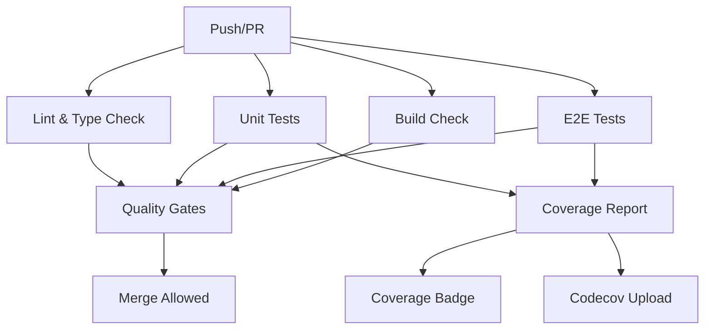

# SafeWork Pro - Testing Strategy

**Version**: 1.0  
**Last Updated**: September 30, 2025  
**Project**: SafeWork Pro - TRA/LMRA Safety Management System  
**Stack**: Next.js 15 + Firebase + TypeScript

---

## Table of Contents

1. [Testing Philosophy](#testing-philosophy)
2. [Testing Pyramid](#testing-pyramid)
3. [Coverage Goals & Metrics](#coverage-goals--metrics)
4. [Test Types & Patterns](#test-types--patterns)
5. [Testing Guidelines by Component Type](#testing-guidelines-by-component-type)
6. [Tools & Infrastructure](#tools--infrastructure)
7. [CI/CD Integration](#cicd-integration)
8. [Best Practices](#best-practices)
9. [Testing Workflows](#testing-workflows)
10. [Quality Gates](#quality-gates)

---

## Testing Philosophy

### Core Principles

1. **Quality First**: Tests are not optional - they're a fundamental part of our development process
2. **Fast Feedback**: Tests should run quickly to enable rapid development cycles
3. **Safety Critical**: Given our TRA/LMRA safety domain, reliability is paramount
4. **User-Centric**: Tests should validate actual user workflows, not just code coverage
5. **Maintainable**: Test code should be as clean and maintainable as production code

### Testing Goals

- **Prevent Regressions**: Ensure changes don't break existing functionality
- **Document Behavior**: Tests serve as living documentation of system behavior
- **Enable Refactoring**: Comprehensive tests allow confident code improvements
- **Risk Mitigation**: Catch critical safety-related bugs before production
- **Development Speed**: Well-tested code enables faster feature development

---

## Testing Pyramid

Our testing strategy follows the classic testing pyramid with emphasis on unit tests and critical user journey E2E tests.

```
        /\
       /  \
      / E2E \     <- Few, Critical User Journeys
     /______\     
    /        \
   /Integration\ <- Firebase, API, Component Integration
  /__________\
 /            \
/  Unit Tests  \  <- Many, Fast, Focused
/______________\
```

### Distribution Target

- **Unit Tests**: ~70% of total test effort
  - Fast execution (<10ms per test)
  - High coverage of business logic
  - Mock external dependencies

- **Integration Tests**: ~20% of total test effort
  - Firebase operations
  - Component interactions
  - API endpoint testing

- **End-to-End Tests**: ~10% of total test effort
  - Critical user workflows
  - Cross-browser compatibility
  - Mobile PWA functionality

---

## Coverage Goals & Metrics

### Coverage Thresholds

Current configuration enforces **80% minimum coverage** across all metrics:

```javascript
coverageThreshold: {
  global: {
    branches: 80,
    functions: 80,
    lines: 80,
    statements: 80,
  },
}
```

### Coverage Categories

| **Component Type** | **Target Coverage** | **Priority** | **Focus Areas** |
|-------------------|-------------------|-------------|----------------|
| **Business Logic** | 95%+ | Critical | Risk calculations, validation |
| **UI Components** | 85%+ | High | Props, state, interactions |
| **API Routes** | 90%+ | Critical | Authentication, data validation |
| **Utilities** | 95%+ | High | Pure functions, transformations |
| **Firebase Logic** | 85%+ | High | Security rules, data operations |

### Quality Metrics

Beyond coverage percentage, we track:

- **Test Execution Time**: Unit tests <5min, E2E tests <15min
- **Test Reliability**: <1% flaky test rate
- **Mutation Testing Score**: 80%+ (future enhancement)
- **Critical Path Coverage**: 100% for safety-related workflows

---

## Test Types & Patterns

### 1. Unit Tests

**Purpose**: Test individual functions, components, and classes in isolation

**Tools**: Jest, React Testing Library, Jest-dom

**Naming Convention**: `ComponentName.test.tsx` or `functionName.test.ts`

**Example Structure**:
```typescript
// Button.test.tsx
import { render, screen, fireEvent } from '@testing-library/react';
import { Button } from './Button';

describe('Button', () => {
  it('should render with correct text', () => {
    render(<Button>Click me</Button>);
    expect(screen.getByRole('button')).toHaveTextContent('Click me');
  });

  it('should call onClick when clicked', () => {
    const handleClick = jest.fn();
    render(<Button onClick={handleClick}>Click me</Button>);
    fireEvent.click(screen.getByRole('button'));
    expect(handleClick).toHaveBeenCalledTimes(1);
  });
});
```

### 2. Integration Tests

**Purpose**: Test component interactions and Firebase operations

**Tools**: Jest, Firebase Emulator, React Testing Library

**Example Structure**:
```typescript
// TRAService.integration.test.ts
import { connectFirestoreEmulator } from 'firebase/firestore';
import { TRAService } from '../services/TRAService';

describe('TRAService Integration', () => {
  beforeAll(() => {
    // Connect to emulator
    connectFirestoreEmulator(db, 'localhost', 8080);
  });

  it('should create TRA with proper validation', async () => {
    const tra = await TRAService.create({
      title: 'Test TRA',
      projectId: 'project-123',
      // ... other fields
    });
    
    expect(tra.id).toBeDefined();
    expect(tra.status).toBe('draft');
  });
});
```

### 3. End-to-End Tests

**Purpose**: Test complete user workflows across the application

**Tools**: Cypress, Firebase Emulator

**Example Structure**:
```typescript
// tra-creation.cy.ts
describe('TRA Creation Workflow', () => {
  beforeEach(() => {
    // Seed database
    cy.task('seedDatabase');
    cy.login('safety-manager@company.com');
  });

  it('should create TRA from template', () => {
    cy.visit('/tras/new');
    
    // Select template
    cy.get('[data-cy=template-select]').click();
    cy.get('[data-cy=template-electrical]').click();
    
    // Fill basic info
    cy.get('[data-cy=tra-title]').type('Electrical Panel Maintenance');
    cy.get('[data-cy=project-select]').select('Project Alpha');
    
    // Add task step
    cy.get('[data-cy=add-task-step]').click();
    cy.get('[data-cy=step-description]').type('Isolate power supply');
    
    // Add hazard
    cy.get('[data-cy=add-hazard]').click();
    cy.get('[data-cy=hazard-electrical-shock]').click();
    
    // Set risk scores
    cy.get('[data-cy=exposure-score]').select('6');
    cy.get('[data-cy=effect-score]').select('15');
    cy.get('[data-cy=probability-score]').select('1');
    
    // Save TRA
    cy.get('[data-cy=save-tra]').click();
    
    // Verify creation
    cy.url().should('include', '/tras/');
    cy.get('[data-cy=tra-title]').should('contain', 'Electrical Panel Maintenance');
    cy.get('[data-cy=risk-score]').should('contain', '90'); // 6*15*1
  });
});
```

---

## Testing Guidelines by Component Type

### UI Components

**Focus Areas**:
- Props validation and rendering
- User interactions (clicks, form inputs)
- Accessibility (ARIA labels, keyboard navigation)
- Responsive behavior
- State management

**Testing Pattern**:
```typescript
describe('FormField Component', () => {
  const defaultProps = {
    name: 'email',
    label: 'Email Address',
    type: 'email'
  };

  it('should render with required props', () => {
    render(<FormField {...defaultProps} />);
    expect(screen.getByLabelText('Email Address')).toBeInTheDocument();
  });

  it('should show validation error', () => {
    render(<FormField {...defaultProps} error="Invalid email" />);
    expect(screen.getByText('Invalid email')).toBeInTheDocument();
  });

  it('should be accessible', () => {
    render(<FormField {...defaultProps} required />);
    const input = screen.getByLabelText('Email Address');
    expect(input).toHaveAttribute('aria-required', 'true');
  });
});
```

### Business Logic / Services

**Focus Areas**:
- Input validation and edge cases
- Error handling and recovery
- Data transformations
- Algorithm correctness (especially risk calculations)

**Testing Pattern**:
```typescript
describe('RiskCalculator', () => {
  describe('calculateKinneyWiruth', () => {
    it('should calculate risk score correctly', () => {
      const result = RiskCalculator.calculateKinneyWiruth({
        exposure: 6,
        effect: 15,
        probability: 1
      });
      
      expect(result.score).toBe(90);
      expect(result.level).toBe('substantial');
    });

    it('should throw error for invalid inputs', () => {
      expect(() => {
        RiskCalculator.calculateKinneyWiruth({
          exposure: 0, // Invalid
          effect: 15,
          probability: 1
        });
      }).toThrow('Exposure score must be between 1 and 10');
    });
  });
});
```

### API Routes (Next.js)

**Focus Areas**:
- Authentication and authorization
- Input validation (Zod schemas)
- Error responses
- Rate limiting
- Database operations

**Testing Pattern**:
```typescript
describe('/api/tras', () => {
  describe('POST /api/tras', () => {
    it('should create TRA with valid data', async () => {
      const traData = {
        title: 'Test TRA',
        projectId: 'project-123',
        templateId: 'template-456'
      };

      const response = await request(app)
        .post('/api/tras')
        .set('Authorization', `Bearer ${validToken}`)
        .send(traData)
        .expect(201);

      expect(response.body.data.title).toBe('Test TRA');
      expect(response.body.data.status).toBe('draft');
    });

    it('should reject invalid data', async () => {
      const response = await request(app)
        .post('/api/tras')
        .set('Authorization', `Bearer ${validToken}`)
        .send({ title: '' }) // Missing required fields
        .expect(400);

      expect(response.body.error).toBe('VALIDATION_FAILED');
    });
  });
});
```

### Firebase Integration

**Focus Areas**:
- Security rules validation
- Real-time listeners
- Batch operations
- Multi-tenant data isolation

**Testing Pattern**:
```typescript
describe('TRA Firestore Security', () => {
  it('should allow organization members to read TRAs', async () => {
    const db = getFirestore();
    const traRef = doc(db, 'organizations/org-1/tras/tra-1');
    
    await assertSucceeds(
      getDoc(traRef),
      { uid: 'user-1', orgId: 'org-1', role: 'safety_manager' }
    );
  });

  it('should deny cross-organization access', async () => {
    const db = getFirestore();
    const traRef = doc(db, 'organizations/org-1/tras/tra-1');
    
    await assertFails(
      getDoc(traRef),
      { uid: 'user-2', orgId: 'org-2', role: 'admin' }
    );
  });
});
```

### PWA & Mobile Features

**Focus Areas**:
- Offline functionality
- Service worker behavior
- Camera integration
- GPS features
- Touch interactions

**Testing Pattern**:
```typescript
describe('Offline Photo Capture', () => {
  it('should store photos locally when offline', () => {
    cy.visit('/lmra/session-123');
    
    // Simulate offline
    cy.window().then((win) => {
      win.navigator.onLine = false;
    });
    
    cy.get('[data-cy=camera-button]').click();
    cy.get('[data-cy=capture-photo]').click();
    
    // Verify local storage
    cy.window().its('localStorage')
      .invoke('getItem', 'pending-photos')
      .should('exist');
  });
});
```

---

## Tools & Infrastructure

### Testing Framework Stack

| **Tool** | **Purpose** | **Configuration** |
|----------|-------------|-------------------|
| **Jest** | Unit testing framework | [`jest.config.js`](web/jest.config.js:1) |
| **React Testing Library** | Component testing | Jest setup file |
| **Cypress** | E2E testing | [`cypress.config.ts`](web/cypress.config.ts:1) |
| **Firebase Emulator** | Integration testing | [`firebase.json`](firebase.json:1) |
| **Codecov** | Coverage reporting | GitHub Actions |
| **@cypress/code-coverage** | E2E coverage | Cypress plugin |

### Development Scripts

```json
{
  "scripts": {
    "test": "jest",
    "test:watch": "jest --watch",
    "test:coverage": "jest --coverage",
    "test:ci": "jest --coverage --watchAll=false --passWithNoTests",
    "e2e": "cypress run",
    "e2e:open": "cypress open",
    "test:all": "npm run test:ci && npm run e2e",
    "emulators:test": "firebase emulators:exec --only firestore,auth,storage \"npm run test\"",
    "emulators:e2e": "firebase emulators:exec --only firestore,auth,storage \"npm run e2e\""
  }
}
```

### File Structure

```
web/
├── src/
│   ├── __tests__/              # Global test utilities
│   ├── components/
│   │   ├── ui/
│   │   │   ├── Button.tsx
│   │   │   └── __tests__/
│   │   │       └── Button.test.tsx
│   │   └── forms/
│   │       ├── ExampleForm.tsx
│   │       └── __tests__/
│   │           └── ExampleForm.test.tsx
│   ├── lib/
│   │   ├── api/
│   │   │   ├── auth.ts
│   │   │   └── __tests__/
│   │   │       └── auth.test.ts
│   │   └── services/
│   │       ├── TRAService.ts
│   │       └── __tests__/
│   │           └── TRAService.test.ts
├── cypress/
│   ├── e2e/
│   │   ├── auth.cy.ts
│   │   ├── tra-creation.cy.ts
│   │   └── lmra-execution.cy.ts
│   ├── fixtures/
│   │   └── users.json
│   └── support/
│       ├── commands.ts
│       └── e2e.ts
├── jest.config.js
├── jest.setup.js
└── cypress.config.ts
```

---

## CI/CD Integration

Our GitHub Actions workflow ([`.github/workflows/ci.yml`](.github/workflows/ci.yml:1)) provides comprehensive testing automation.

### Workflow Overview



### Pipeline Stages

1. **Lint & Type Check** (2-3 minutes)
   - ESLint validation
   - TypeScript type checking  
   - Prettier formatting verification

2. **Unit Tests** (3-5 minutes)
   - Jest test execution with coverage
   - Firebase emulator startup
   - Coverage threshold enforcement

3. **E2E Tests** (8-12 minutes)
   - Next.js build
   - Firebase emulator startup
   - Cypress test execution
   - Screenshot/video capture on failure

4. **Build Check** (2-3 minutes)
   - Production build validation
   - Bundle size analysis
   - Environment validation

5. **Coverage Reporting** (1-2 minutes)
   - Coverage badge generation
   - Codecov integration
   - PR coverage comments

### Environment Variables

Required for CI/CD pipeline:

```bash
# GitHub Secrets
CODECOV_TOKEN=xxx          # Coverage reporting
CYPRESS_RECORD_KEY=xxx     # Cypress Dashboard (optional)

# Firebase (for emulator testing)
FIREBASE_PROJECT_ID=hale-ripsaw-403915
```

---

## Best Practices

### Test Writing Guidelines

1. **AAA Pattern**: Arrange, Act, Assert
   ```typescript
   it('should calculate risk correctly', () => {
     // Arrange
     const input = { exposure: 6, effect: 15, probability: 1 };
     
     // Act
     const result = calculateRisk(input);
     
     // Assert
     expect(result.score).toBe(90);
   });
   ```

2. **Descriptive Test Names**: Use "should [expected behavior] when [condition]"
   ```typescript
   // Good
   it('should show validation error when email is invalid')
   
   // Avoid
   it('test email validation')
   ```

3. **Single Responsibility**: One assertion per test concept
   ```typescript
   // Good - focused test
   it('should calculate correct risk score', () => {
     expect(result.score).toBe(90);
   });
   
   it('should assign correct risk level', () => {
     expect(result.level).toBe('substantial');
   });
   ```

4. **Test Data Builders**: Use factories for complex test data
   ```typescript
   const createTRABuilder = () => ({
     title: 'Test TRA',
     projectId: 'project-123',
     status: 'draft',
     with: function(overrides: Partial<TRA>) {
       return { ...this, ...overrides };
     }
   });
   
   // Usage
   const tra = createTRABuilder().with({ status: 'approved' });
   ```

### Mock Strategy

1. **Mock External Dependencies**: APIs, Firebase, third-party libraries
2. **Don't Mock What You Don't Own**: Test real implementations when possible
3. **Use MSW for API Mocking**: More realistic than Jest mocks
4. **Mock at the Service Layer**: Keep component tests focused

### Performance Guidelines

1. **Fast Unit Tests**: Each test should complete in <10ms
2. **Parallel Execution**: Use Jest's parallel execution
3. **Selective E2E Tests**: Only test critical user paths
4. **Smart Test Selection**: Run relevant tests based on changed files

---

## Testing Workflows

### Daily Development Workflow

1. **Write Test First** (TDD approach for critical logic)
   ```bash
   # Write failing test
   npm run test:watch -- --testNamePattern="should calculate risk"
   
   # Implement feature
   # Watch test pass
   ```

2. **Pre-Commit Validation**
   ```bash
   # Automatic via Husky hooks
   npm run lint:fix
   npm run test:ci
   npm run format
   ```

3. **Feature Branch Workflow**
   ```bash
   # Before pushing
   npm run test:all              # Run full test suite
   npm run build                 # Verify build works
   ```

### PR Review Workflow

1. **Automated Checks**: All CI checks must pass
2. **Coverage Review**: New code should maintain 80%+ coverage
3. **Test Quality Review**: Tests should follow established patterns
4. **Manual Testing**: Critical features require manual verification

### Release Workflow

1. **Full Test Suite**: All tests must pass on main branch
2. **Performance Testing**: E2E tests with performance budgets
3. **Cross-Browser Testing**: Chrome, Firefox, Safari validation
4. **Mobile Testing**: PWA functionality verification

---

## Quality Gates

### Code Quality Requirements

| **Metric** | **Requirement** | **Enforcement** |
|------------|----------------|----------------|
| **Test Coverage** | ≥80% all metrics | CI pipeline failure |
| **Test Execution** | <5min unit, <15min E2E | Performance monitoring |
| **Code Quality** | ESLint passing | Pre-commit hook |
| **Type Safety** | TypeScript strict mode | CI pipeline |
| **Security** | No high vulnerabilities | `npm audit` in CI |

### Merge Requirements

To merge to `main` branch:

- ✅ All CI checks passing
- ✅ Code review approval
- ✅ Coverage thresholds met
- ✅ No security vulnerabilities
- ✅ Documentation updated (if needed)

### Release Requirements

To deploy to production:

- ✅ All quality gates passing
- ✅ E2E tests passing on staging
- ✅ Performance budgets met
- ✅ Security scan clean
- ✅ Database migration tested (if applicable)

---

## Future Enhancements

### Planned Improvements

1. **Visual Regression Testing** (Q2 2025)
   - Percy or Chromatic integration
   - Component screenshot comparisons
   - Cross-browser visual validation

2. **Performance Testing** (Q2 2025)
   - Lighthouse CI integration
   - Core Web Vitals monitoring
   - Bundle size regression detection

3. **Accessibility Testing** (Q3 2025)
   - Automated a11y testing with axe-core
   - Screen reader testing
   - WCAG 2.1 AA compliance validation

4. **Mutation Testing** (Q3 2025)
   - Stryker.js integration
   - Test quality measurement
   - 80%+ mutation score target

5. **Contract Testing** (Q4 2025)
   - API contract validation
   - Firebase schema testing
   - Cross-service compatibility

### Monitoring & Analytics

- **Test Metrics Dashboard**: Track test execution trends
- **Coverage Trends**: Monitor coverage over time
- **Flaky Test Detection**: Identify and fix unreliable tests
- **Performance Regression**: Track test execution performance

---

## Conclusion

This testing strategy provides a comprehensive framework for ensuring the quality and reliability of SafeWork Pro. By following the testing pyramid, maintaining high coverage standards, and leveraging automated CI/CD pipelines, we can deliver a robust safety management system that our users can trust.

The strategy emphasizes practical, maintainable testing practices that support rapid development while maintaining the high quality standards required for safety-critical applications.

**Remember**: Tests are not just about catching bugs—they're about enabling confident, rapid development and ensuring the safety of workers who depend on our system.

---

**Next Steps**:
1. Review and approve this testing strategy
2. Implement any missing test patterns
3. Set up monitoring for test metrics
4. Train team members on testing best practices
5. Regular review and updates as the application evolves