# SafeWork Pro - Flow Diagrammen

<!-- Mermaid blocks validated and syntax-corrected on 2025-09-30 — edits limited to syntax fixes for renderer compatibility. -->

**Doelgroep**: Administrators, Developers, Stakeholders
**Versie**: 2.0.0
**Laatste Update**: 30 september 2025

## 📋 Overzicht Flows

Dit document bevat alle belangrijke Mermaid flow diagrammen voor SafeWork Pro, van gebruiker registratie tot TRA/LMRA workflows.

---

## 1️⃣ Gebruiker Registratie & Authenticatie Flows

### Nieuwe Gebruiker Registratie Flow

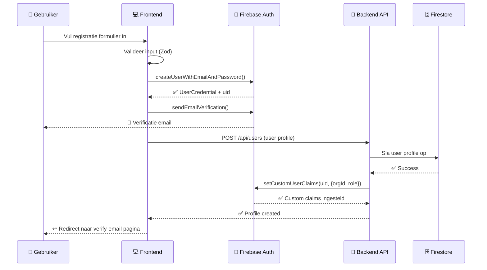
```mermaid
sequenceDiagram
    participant U as 👤 Gebruiker
    participant FE as 💻 Frontend
    participant FB as 🔐 Firebase Auth
    participant API as 🔧 Backend API
    participant FS as 🗄️ Firestore

    U->>FE: Vul registratie formulier in
    FE->>FE: Valideer input (Zod)
    
    FE->>FB: createUserWithEmailAndPassword()
    FB-->>FE: ✅ UserCredential + uid
    
    FE->>FB: sendEmailVerification()
    FB-->>U: 📧 Verificatie email
    
    FE->>API: POST /api/users (user profile)
    API->>FS: Sla user profile op
    FS-->>API: ✅ Success
    
    API->>FB: setCustomUserClaims(uid, {orgId, role})
    FB-->>API: ✅ Custom claims ingesteld
    
    API-->>FE: ✅ Profile created
    FE-->>U: ↩️ Redirect naar verify-email pagina
```

### Google SSO Registratie Flow

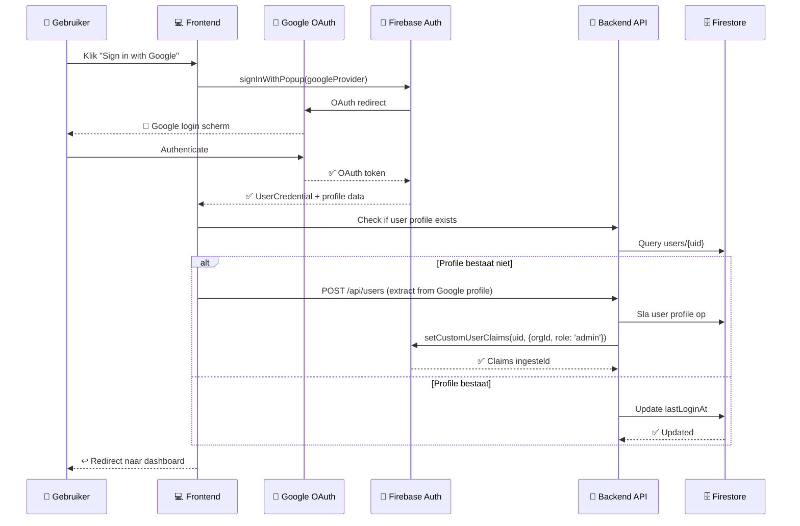
```mermaid
sequenceDiagram
    participant U as 👤 Gebruiker
    participant FE as 💻 Frontend
    participant G as 🔵 Google OAuth
    participant FB as 🔐 Firebase Auth
    participant API as 🔧 Backend API
    participant FS as 🗄️ Firestore

    U->>FE: Klik "Sign in with Google"
    FE->>FB: signInWithPopup(googleProvider)
    FB->>G: OAuth redirect
    G-->>U: 🔵 Google login scherm
    
    U->>G: Authenticate
    G-->>FB: ✅ OAuth token
    FB-->>FE: ✅ UserCredential + profile data
    
    FE->>API: Check if user profile exists
    API->>FS: Query users/{uid}
    
    alt Profile bestaat niet
        FE->>API: POST /api/users (extract from Google profile)
        API->>FS: Sla user profile op
        API->>FB: setCustomUserClaims(uid, {orgId, role: 'admin'})
        FB-->>API: ✅ Claims ingesteld
    else Profile bestaat
        API->>FS: Update lastLoginAt
        FS-->>API: ✅ Updated
    end
    
    FE-->>U: ↩️ Redirect naar dashboard
```

### Login Flow

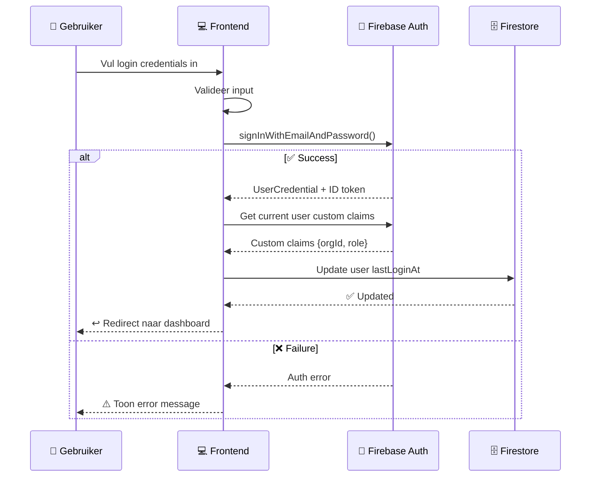
```mermaid
sequenceDiagram
    participant U as 👤 Gebruiker
    participant FE as 💻 Frontend
    participant FB as 🔐 Firebase Auth
    participant FS as 🗄️ Firestore

    U->>FE: Vul login credentials in
    FE->>FE: Valideer input
    FE->>FB: signInWithEmailAndPassword()
    
    alt ✅ Success
        FB-->>FE: UserCredential + ID token
        FE->>FB: Get current user custom claims
        FB-->>FE: Custom claims {orgId, role}
        FE->>FS: Update user lastLoginAt
        FS-->>FE: ✅ Updated
        FE-->>U: ↩️ Redirect naar dashboard
    else ❌ Failure
        FB-->>FE: Auth error
        FE-->>U: ⚠️ Toon error message
    end
```

### Wachtwoord Reset Flow

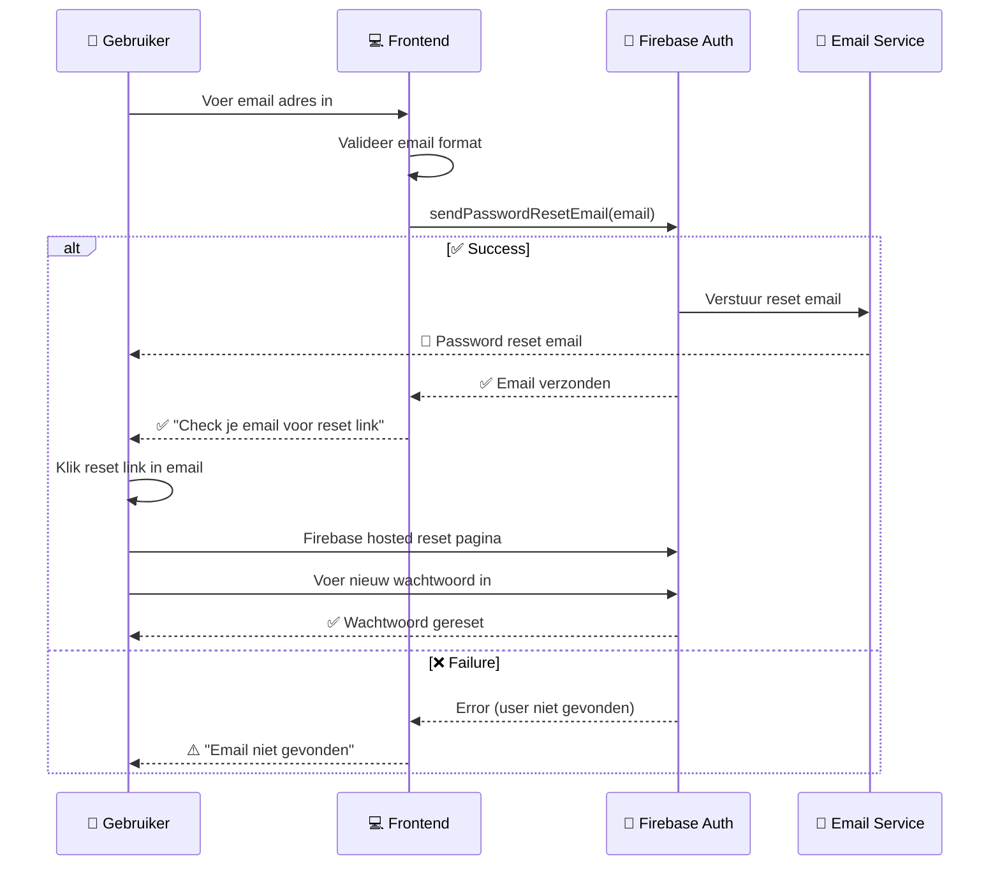
```mermaid
sequenceDiagram
    participant U as 👤 Gebruiker
    participant FE as 💻 Frontend
    participant FB as 🔐 Firebase Auth
    participant EM as 📧 Email Service

    U->>FE: Voer email adres in
    FE->>FE: Valideer email format
    FE->>FB: sendPasswordResetEmail(email)
    
    alt ✅ Success
        FB->>EM: Verstuur reset email
        EM-->>U: 📧 Password reset email
        FB-->>FE: ✅ Email verzonden
        FE-->>U: ✅ "Check je email voor reset link"
        
        U->>U: Klik reset link in email
        U->>FB: Firebase hosted reset pagina
        U->>FB: Voer nieuw wachtwoord in
        FB-->>U: ✅ Wachtwoord gereset
        
    else ❌ Failure
        FB-->>FE: Error (user niet gevonden)
        FE-->>U: ⚠️ "Email niet gevonden"
    end
```

---

## 2️⃣ Organisatie Management Flows

### Nieuwe Organisatie Setup Flow

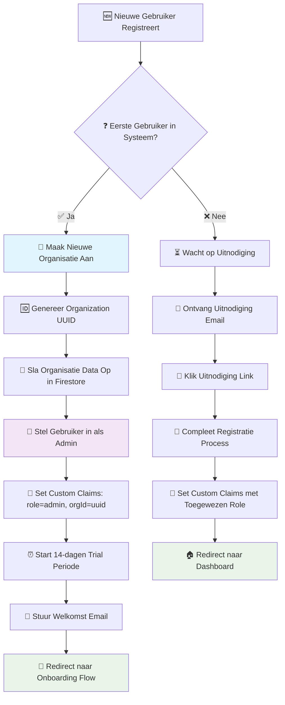
```mermaid
flowchart TD
    A[🆕 Nieuwe Gebruiker Registreert] --> B{❓ Eerste Gebruiker in Systeem?}
    
    B -->|✅ Ja| C[🏢 Maak Nieuwe Organisatie Aan]
    B -->|❌ Nee| D[⏳ Wacht op Uitnodiging]
    
    C --> E[🆔 Genereer Organization UUID]
    E --> F[💾 Sla Organisatie Data Op in Firestore]
    F --> G[👑 Stel Gebruiker in als Admin]
    G --> H[🔐 Set Custom Claims: role=admin, orgId=uuid]
    H --> I[⏰ Start 14-dagen Trial Periode]
    I --> J[📧 Stuur Welkomst Email]
    J --> K[🚀 Redirect naar Onboarding Flow]
    
    D --> L[📧 Ontvang Uitnodiging Email]
    L --> M[🔗 Klik Uitnodiging Link]
    M --> N[📝 Compleet Registratie Process]
    N --> O[🔐 Set Custom Claims met Toegewezen Role]
    O --> P[🏠 Redirect naar Dashboard]
    
    style C fill:#e1f5fe
    style G fill:#f3e5f5
    style K fill:#e8f5e8
    style P fill:#e8f5e8
```

### Gebruiker Uitnodigen Flow

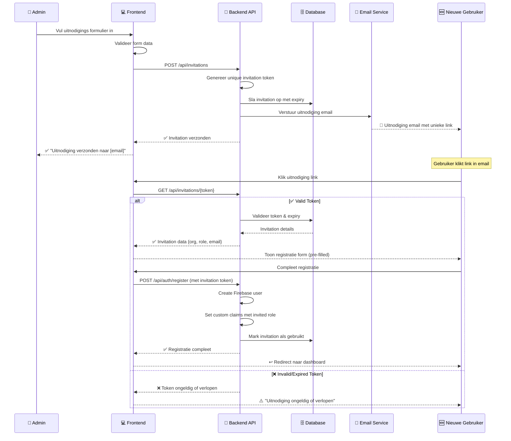
```mermaid
sequenceDiagram
    participant A as 👑 Admin
    participant FE as 💻 Frontend
    participant API as 🔧 Backend API
    participant DB as 🗄️ Database
    participant EM as 📧 Email Service
    participant NU as 🆕 Nieuwe Gebruiker

    A->>FE: Vul uitnodigings formulier in
    FE->>FE: Valideer form data
    FE->>API: POST /api/invitations
    
    API->>API: Genereer unique invitation token
    API->>DB: Sla invitation op met expiry
    API->>EM: Verstuur uitnodiging email
    
    EM-->>NU: 📧 Uitnodiging email met unieke link
    API-->>FE: ✅ Invitation verzonden
    FE-->>A: ✅ "Uitnodiging verzonden naar [email]"
    
    Note over NU: Gebruiker klikt link in email
    
    NU->>FE: Klik uitnodiging link
    FE->>API: GET /api/invitations/{token}
    
    alt ✅ Valid Token
        API->>DB: Valideer token & expiry
        DB-->>API: Invitation details
        API-->>FE: ✅ Invitation data {org, role, email}
        FE-->>NU: Toon registratie form (pre-filled)
        
        NU->>FE: Compleet registratie
        FE->>API: POST /api/auth/register (met invitation token)
        API->>API: Create Firebase user
        API->>API: Set custom claims met invited role
        API->>DB: Mark invitation als gebruikt
        API-->>FE: ✅ Registratie compleet
        FE-->>NU: ↩️ Redirect naar dashboard
        
    else ❌ Invalid/Expired Token
        API-->>FE: ❌ Token ongeldig of verlopen
        FE-->>NU: ⚠️ "Uitnodiging ongeldig of verlopen"
    end
```

---

## 3️⃣ Role-Based Access Control Flow

### Role Assignment Flow

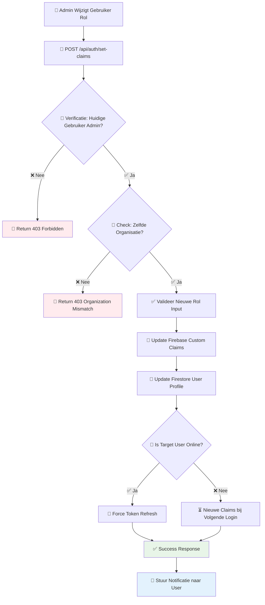
```mermaid
flowchart TD
    A[👑 Admin Wijzigt Gebruiker Rol] --> B[📡 POST /api/auth/set-claims]
    B --> C{🔐 Verificatie: Huidige Gebruiker Admin?}
    
    C -->|❌ Nee| D[🚫 Return 403 Forbidden]
    C -->|✅ Ja| E{🏢 Check: Zelfde Organisatie?}
    
    E -->|❌ Nee| F[🚫 Return 403 Organization Mismatch]
    E -->|✅ Ja| G[✅ Valideer Nieuwe Rol Input]
    
    G --> H[🔐 Update Firebase Custom Claims]
    H --> I[💾 Update Firestore User Profile]
    I --> J{📱 Is Target User Online?}
    
    J -->|✅ Ja| K[🔄 Force Token Refresh]
    J -->|❌ Nee| L[⏳ Nieuwe Claims bij Volgende Login]
    
    K --> M[✅ Success Response]
    L --> M
    M --> N[📧 Stuur Notificatie naar User]
    
    style D fill:#ffebee
    style F fill:#ffebee
    style M fill:#e8f5e8
    style N fill:#e3f2fd
```

### API Request Authorization Flow

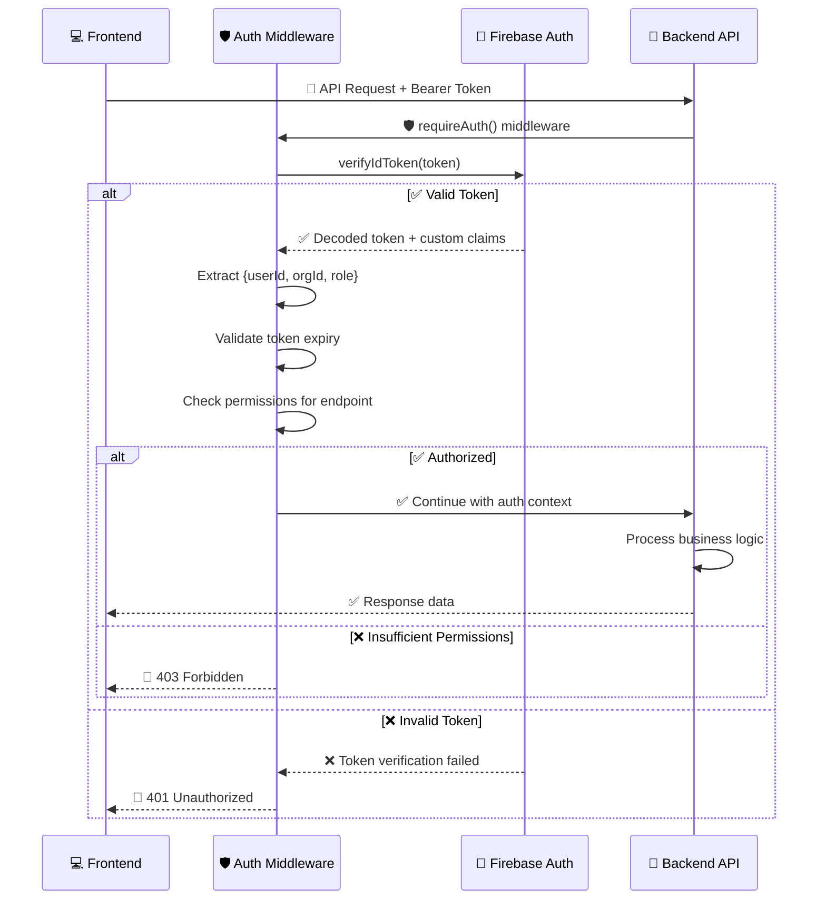
```mermaid
sequenceDiagram
    participant FE as 💻 Frontend
    participant MW as 🛡️ Auth Middleware
    participant FB as 🔐 Firebase Auth
    participant API as 🔧 Backend API

    FE->>API: 📡 API Request + Bearer Token
    API->>MW: 🛡️ requireAuth() middleware
    
    MW->>FB: verifyIdToken(token)
    
    alt ✅ Valid Token
        FB-->>MW: ✅ Decoded token + custom claims
        MW->>MW: Extract {userId, orgId, role}
        MW->>MW: Validate token expiry
        MW->>MW: Check permissions for endpoint
        
        alt ✅ Authorized
            MW->>API: ✅ Continue with auth context
            API->>API: Process business logic
            API-->>FE: ✅ Response data
        else ❌ Insufficient Permissions
            MW-->>FE: 🚫 403 Forbidden
        end
        
    else ❌ Invalid Token
        FB-->>MW: ❌ Token verification failed
        MW-->>FE: 🚫 401 Unauthorized
    end
```

---

## 4️⃣ TRA/LMRA Workflow Flows

### TRA Creation Workflow

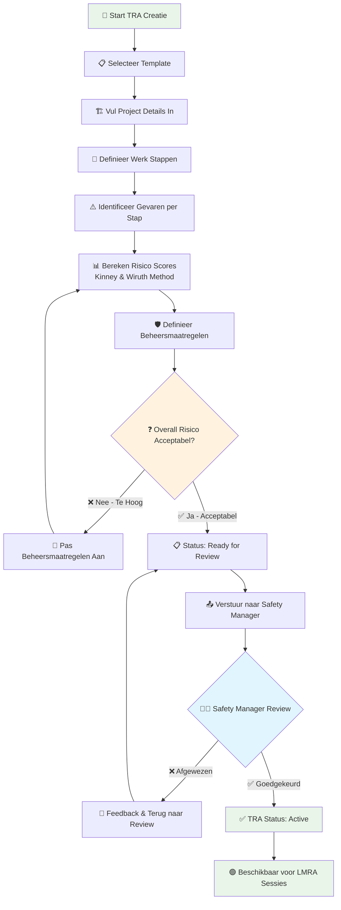
```mermaid
flowchart TD
    A[🚀 Start TRA Creatie] --> B[📋 Selecteer Template]
    B --> C[🏗️ Vul Project Details In]
    C --> D[📝 Definieer Werk Stappen]
    
    D --> E[⚠️ Identificeer Gevaren per Stap]
    E --> F[📊 Bereken Risico Scores<br/>Kinney & Wiruth Method]
    F --> G[🛡️ Definieer Beheersmaatregelen]
    
    G --> H{❓ Overall Risico Acceptabel?}
    H -->|❌ Nee - Te Hoog| I[🔄 Pas Beheersmaatregelen Aan]
    I --> F
    
    H -->|✅ Ja - Acceptabel| J[📋 Status: Ready for Review]
    J --> K[📤 Verstuur naar Safety Manager]
    
    K --> L{👨‍💼 Safety Manager Review}
    L -->|❌ Afgewezen| M[📝 Feedback & Terug naar Review]
    L -->|✅ Goedgekeurd| N[✅ TRA Status: Active]
    
    M --> J
    N --> O[🟢 Beschikbaar voor LMRA Sessies]
    
    style A fill:#e8f5e8
    style H fill:#fff3e0
    style L fill:#e1f5fe
    style N fill:#e8f5e8
    style O fill:#e8f5e8
```

### LMRA Execution Flow

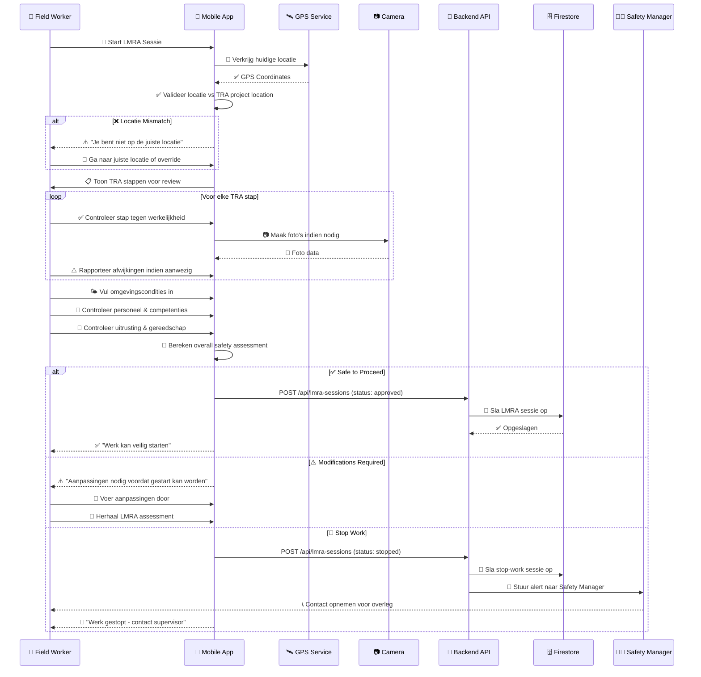
```mermaid
sequenceDiagram
    participant FW as 👷 Field Worker
    participant APP as 📱 Mobile App
    participant GPS as 🛰️ GPS Service
    participant CAM as 📷 Camera
    participant API as 🔧 Backend API
    participant FS as 🗄️ Firestore
    participant SM as 👨‍💼 Safety Manager

    FW->>APP: 🚀 Start LMRA Sessie
    APP->>GPS: 📍 Verkrijg huidige locatie
    GPS-->>APP: ✅ GPS Coordinates
    APP->>APP: ✅ Valideer locatie vs TRA project location
    
    alt ❌ Locatie Mismatch
        APP-->>FW: ⚠️ "Je bent niet op de juiste locatie"
        FW->>APP: 🚶 Ga naar juiste locatie of override
    end
    
    APP->>FW: 📋 Toon TRA stappen voor review
    
    loop Voor elke TRA stap
        FW->>APP: ✅ Controleer stap tegen werkelijkheid
        APP->>CAM: 📷 Maak foto's indien nodig
        CAM-->>APP: 📸 Foto data
        FW->>APP: ⚠️ Rapporteer afwijkingen indien aanwezig
    end
    
    FW->>APP: 🌤️ Vul omgevingscondities in
    FW->>APP: 👥 Controleer personeel & competenties
    FW->>APP: 🔧 Controleer uitrusting & gereedschap
    
    APP->>APP: 🧮 Bereken overall safety assessment
    
    alt ✅ Safe to Proceed
        APP->>API: POST /api/lmra-sessions (status: approved)
        API->>FS: 💾 Sla LMRA sessie op
        FS-->>API: ✅ Opgeslagen
        APP-->>FW: ✅ "Werk kan veilig starten"
        
    else ⚠️ Modifications Required
        APP-->>FW: ⚠️ "Aanpassingen nodig voordat gestart kan worden"
        FW->>APP: 🔄 Voer aanpassingen door
        FW->>APP: 🔄 Herhaal LMRA assessment
        
    else 🛑 Stop Work
        APP->>API: POST /api/lmra-sessions (status: stopped)
        API->>FS: 💾 Sla stop-work sessie op
        API->>SM: 🚨 Stuur alert naar Safety Manager
        SM-->>FW: 📞 Contact opnemen voor overleg
        APP-->>FW: 🛑 "Werk gestopt - contact supervisor"
    end
```

---

## 5️⃣ Data Management & Security Flows

### Firebase Security Rules Flow

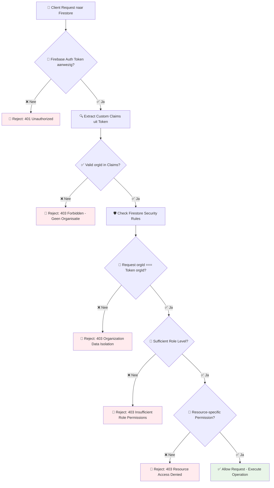
```mermaid
flowchart TD
    A[📡 Client Request naar Firestore] --> B{🔐 Firebase Auth Token aanwezig?}
    
    B -->|❌ Nee| C[🚫 Reject: 401 Unauthorized]
    B -->|✅ Ja| D[🔍 Extract Custom Claims uit Token]
    
    D --> E{✅ Valid orgId in Claims?}
    E -->|❌ Nee| F[🚫 Reject: 403 Forbidden - Geen Organisatie]
    E -->|✅ Ja| G[🛡️ Check Firestore Security Rules]
    
    G --> H{🏢 Request orgId === Token orgId?}
    H -->|❌ Nee| I[🚫 Reject: 403 Organization Data Isolation]
    H -->|✅ Ja| J{👑 Sufficient Role Level?}
    
    J -->|❌ Nee| K[🚫 Reject: 403 Insufficient Role Permissions]
    J -->|✅ Ja| L{📝 Resource-specific Permission?}
    
    L -->|❌ Nee| M[🚫 Reject: 403 Resource Access Denied]
    L -->|✅ Ja| N[✅ Allow Request - Execute Operation]
    
    style C fill:#ffebee
    style F fill:#ffebee
    style I fill:#ffebee
    style K fill:#ffebee
    style M fill:#ffebee
    style N fill:#e8f5e8
```

### Data Backup & Recovery Flow

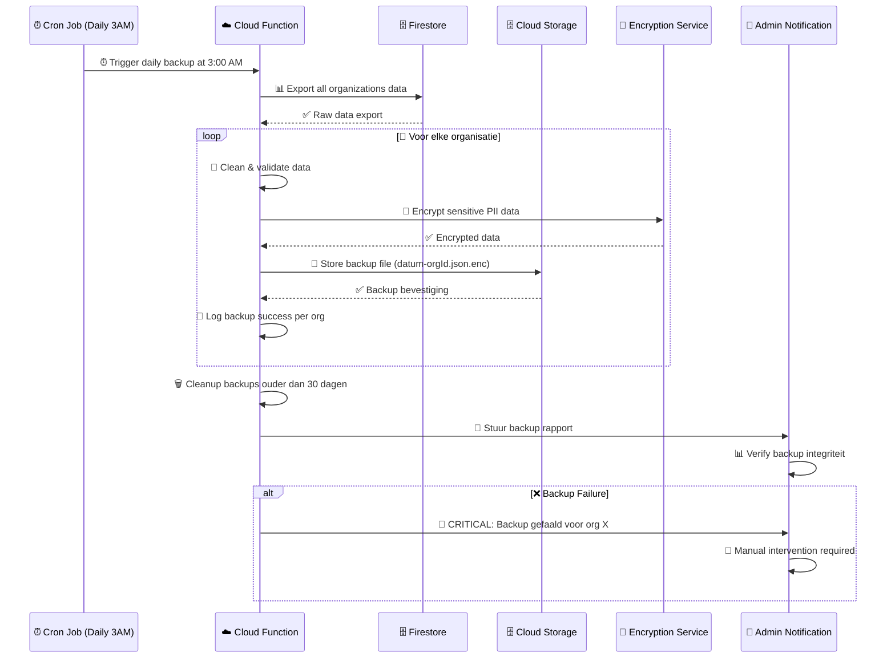
```mermaid
sequenceDiagram
    participant CRON as ⏰ Cron Job (Daily 3AM)
    participant CF as ☁️ Cloud Function
    participant FS as 🗄️ Firestore
    participant GCS as 🗄️ Cloud Storage
    participant CRYPTO as 🔐 Encryption Service
    participant ADMIN as 📧 Admin Notification

    CRON->>CF: ⏰ Trigger daily backup at 3:00 AM
    CF->>FS: 📊 Export all organizations data
    FS-->>CF: ✅ Raw data export
    
    loop 🏢 Voor elke organisatie
        CF->>CF: 🧹 Clean & validate data
        CF->>CRYPTO: 🔐 Encrypt sensitive PII data
        CRYPTO-->>CF: ✅ Encrypted data
        CF->>GCS: 💾 Store backup file (datum-orgId.json.enc)
        GCS-->>CF: ✅ Backup bevestiging
        CF->>CF: 📝 Log backup success per org
    end
    
    CF->>CF: 🗑️ Cleanup backups ouder dan 30 dagen
    CF->>ADMIN: 📧 Stuur backup rapport
    ADMIN->>ADMIN: 📊 Verify backup integriteit
    
    alt ❌ Backup Failure
        CF->>ADMIN: 🚨 CRITICAL: Backup gefaald voor org X
        ADMIN->>ADMIN: 🔧 Manual intervention required
    end
```

---

## 6️⃣ Error Handling & Recovery Flows

### Authentication Error Handling Flow

```mermaid
flowchart TD
    A[🚨 Authentication Error Detected] --> B{❓ Error Type Classification}
    
    B -->|🔑 Invalid Credentials| C[⚠️ Show "Email of wachtwoord incorrect"]
    B -->|⏰ Expired Token| D[🔄 Automatic redirect naar login]
    B -->|🌐 Network Error| E[🔄 Show retry optie met countdown]
    B -->|📧 Email Not Verified| F[📧 Show "Email verificatie vereist"]
    B -->|🚫 Account Disabled| G[📞 Show "Contact administrator"]
    B -->|🔒 Too Many Attempts| H[⏳ Show "Account tijdelijk vergrendeld"]
    
    C --> I[👤 User probeert opnieuw]
    D --> J[👤 User logt opnieuw in]
    E --> K[🔄 Retry automatisch na 3 seconden]
    F --> L[📧 Resend verification email optie]
    G --> M[📝 Create support ticket]
    H --> N[⏳ Wait voor unlock (15 minuten)]
    
    I --> O{✅ Success?}
    J --> O
    K --> O
    L --> P[📧 Email sent, wait for verification]
    
    O -->|✅ Ja| Q[🏠 Redirect naar dashboard]
    O -->|❌ Nee| B
    
    style A fill:#ffebee
    style Q fill:#e8f5e8
    style M fill:#fff3e0
    style P fill:#e3f2fd
```

### LMRA Offline Sync Flow

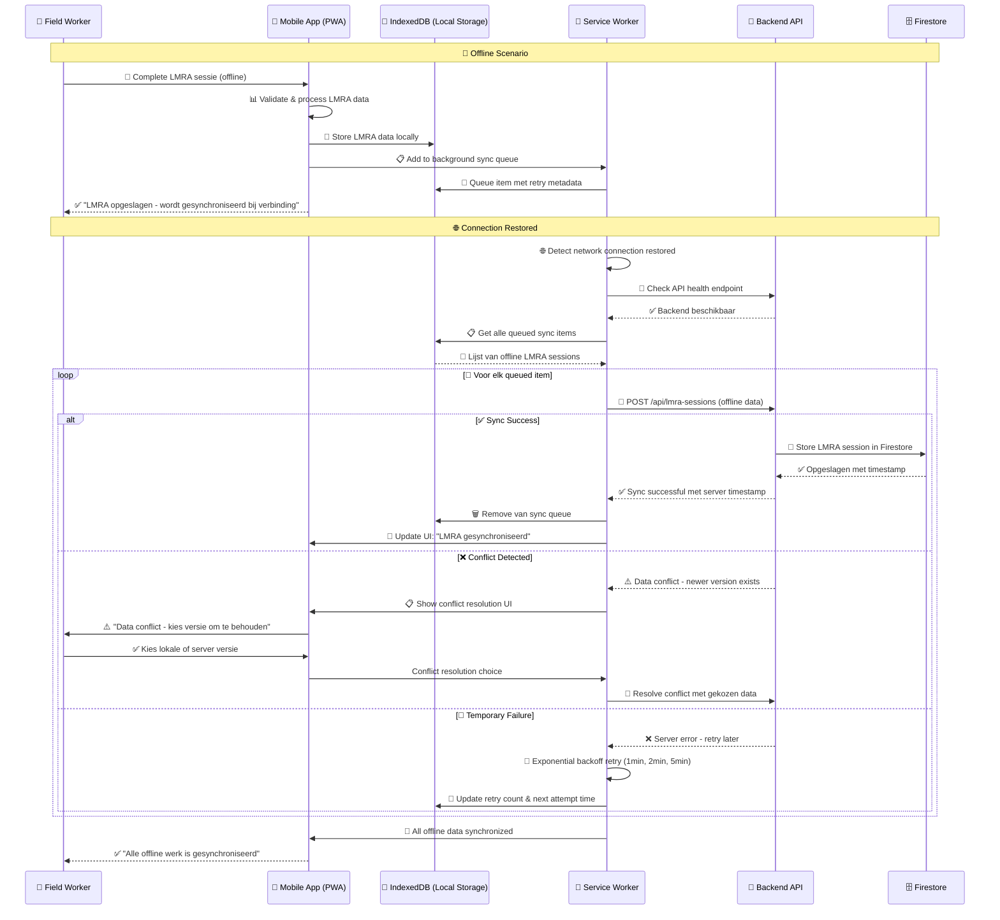
```mermaid
sequenceDiagram
    participant FW as 👷 Field Worker
    participant APP as 📱 Mobile App (PWA)
    participant IDB as 💾 IndexedDB (Local Storage)
    participant SW as 🔧 Service Worker
    participant API as 🔧 Backend API
    participant FS as 🗄️ Firestore

    Note over FW,FS: 📵 Offline Scenario
    
    FW->>APP: 📝 Complete LMRA sessie (offline)
    APP->>APP: 📊 Validate & process LMRA data
    APP->>IDB: 💾 Store LMRA data locally
    APP->>SW: 📋 Add to background sync queue
    SW->>IDB: 💾 Queue item met retry metadata
    
    APP-->>FW: ✅ "LMRA opgeslagen - wordt gesynchroniseerd bij verbinding"
    
    Note over FW,FS: 🌐 Connection Restored
    
    SW->>SW: 🌐 Detect network connection restored
    SW->>API: 🏥 Check API health endpoint
    API-->>SW: ✅ Backend beschikbaar
    
    SW->>IDB: 📋 Get alle queued sync items
    IDB-->>SW: 📄 Lijst van offline LMRA sessions
    
    loop 🔄 Voor elk queued item
        SW->>API: 📡 POST /api/lmra-sessions (offline data)
        
        alt ✅ Sync Success
            API->>FS: 💾 Store LMRA session in Firestore
            FS-->>API: ✅ Opgeslagen met timestamp
            API-->>SW: ✅ Sync successful met server timestamp
            SW->>IDB: 🗑️ Remove van sync queue
            SW->>APP: 🔔 Update UI: "LMRA gesynchroniseerd"
            
        else ❌ Conflict Detected
            API-->>SW: ⚠️ Data conflict - newer version exists
            SW->>APP: 📋 Show conflict resolution UI
            APP->>FW: ⚠️ "Data conflict - kies versie om te behouden"
            FW->>APP: ✅ Kies lokale of server versie
            APP->>SW: Conflict resolution choice
            SW->>API: 📡 Resolve conflict met gekozen data
            
        else 🔄 Temporary Failure
            API-->>SW: ❌ Server error - retry later
            SW->>SW: 🔄 Exponential backoff retry (1min, 2min, 5min)
            SW->>IDB: 📝 Update retry count & next attempt time
        end
    end
    
    SW->>APP: 🎉 All offline data synchronized
    APP-->>FW: ✅ "Alle offline werk is gesynchroniseerd"
```

---

## 7️⃣ Monitoring & Analytics Flows

### Performance Monitoring Flow

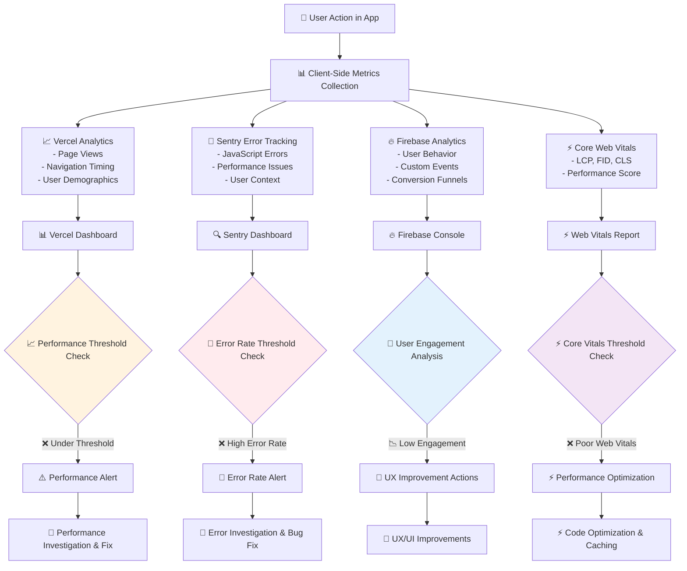
```mermaid
flowchart TD
    A[👤 User Action in App] --> B[📊 Client-Side Metrics Collection]
    
    B --> C[📈 Vercel Analytics<br/>- Page Views<br/>- Navigation Timing<br/>- User Demographics]
    B --> D[🚨 Sentry Error Tracking<br/>- JavaScript Errors<br/>- Performance Issues<br/>- User Context]
    B --> E[🔥 Firebase Analytics<br/>- User Behavior<br/>- Custom Events<br/>- Conversion Funnels]
    B --> F[⚡ Core Web Vitals<br/>- LCP, FID, CLS<br/>- Performance Score]
    
    C --> G[📊 Vercel Dashboard]
    D --> H[🔍 Sentry Dashboard]  
    E --> I[🔥 Firebase Console]
    F --> J[⚡ Web Vitals Report]
    
    G --> K{📈 Performance Threshold Check}
    H --> L{🚨 Error Rate Threshold Check}
    I --> M{👥 User Engagement Analysis}
    J --> N{⚡ Core Vitals Threshold Check}
    
    K -->|❌ Under Threshold| O[⚠️ Performance Alert]
    L -->|❌ High Error Rate| P[🚨 Error Rate Alert]  
    M -->|📉 Low Engagement| Q[📱 UX Improvement Actions]
    N -->|❌ Poor Web Vitals| R[⚡ Performance Optimization]
    
    O --> S[🔧 Performance Investigation & Fix]
    P --> T[🐛 Error Investigation & Bug Fix]
    Q --> U[🎨 UX/UI Improvements]
    R --> V[⚡ Code Optimization & Caching]
    
    style K fill:#fff3e0
    style L fill:#ffebee
    style M fill:#e3f2fd
    style N fill:#f3e5f5
```

### System Health Monitoring Flow

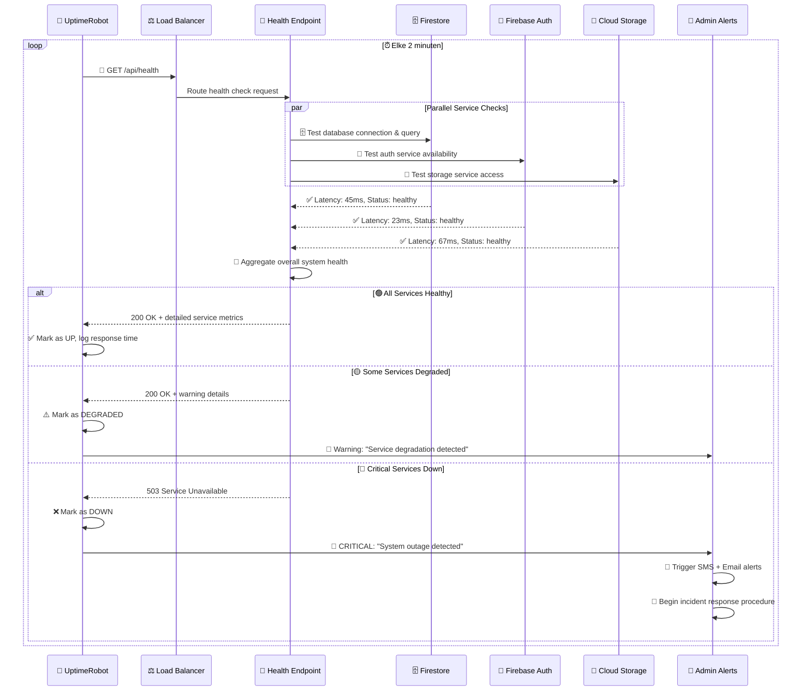
```mermaid
sequenceDiagram
    participant UR as 🤖 UptimeRobot
    participant LB as ⚖️ Load Balancer
    participant API as 🔧 Health Endpoint
    participant FS as 🗄️ Firestore
    participant FB as 🔐 Firebase Auth
    participant STOR as 📁 Cloud Storage
    participant ADMIN as 📧 Admin Alerts

    loop ⏰ Elke 2 minuten
        UR->>LB: 🏥 GET /api/health
        LB->>API: Route health check request
        
        par Parallel Service Checks
            API->>FS: 🗄️ Test database connection & query
            API->>FB: 🔐 Test auth service availability  
            API->>STOR: 📁 Test storage service access
        end
        
        FS-->>API: ✅ Latency: 45ms, Status: healthy
        FB-->>API: ✅ Latency: 23ms, Status: healthy
        STOR-->>API: ✅ Latency: 67ms, Status: healthy
        
        API->>API: 🧮 Aggregate overall system health
        
        alt 🟢 All Services Healthy
            API-->>UR: 200 OK + detailed service metrics
            UR->>UR: ✅ Mark as UP, log response time
            
        else 🟡 Some Services Degraded  
            API-->>UR: 200 OK + warning details
            UR->>UR: ⚠️ Mark as DEGRADED
            UR->>ADMIN: 📧 Warning: "Service degradation detected"
            
        else 🔴 Critical Services Down
            API-->>UR: 503 Service Unavailable
            UR->>UR: ❌ Mark as DOWN
            UR->>ADMIN: 🚨 CRITICAL: "System outage detected"
            ADMIN->>ADMIN: 📱 Trigger SMS + Email alerts
            ADMIN->>ADMIN: 🔧 Begin incident response procedure
        end
    end
```

---

## 📚 Gebruik van Deze Diagrammen

### Voor Developers
- **Implementation Planning**: Volg de flows om features te implementeren
- **Debugging**: Gebruik flows om issues te diagnosticeren
- **Code Reviews**: Reference flows tijdens code review process
- **Testing**: Develop test scenarios gebaseerd op flows

### Voor Admins  
- **User Training**: Leg workflows uit aan nieuwe gebruikers
- **Troubleshooting**: Diagnose problemen met gebruikers
- **Process Documentation**: Gebruik voor operationele handleidingen
- **Incident Response**: Volg flows tijdens incident resolution

### Voor Stakeholders
- **Process Understanding**: Begrijp hoe het systeem werkt
- **Decision Making**: Data-driven beslissingen over features
- **Risk Assessment**: Identificeer potentiële failure points
- **Planning**: Roadmap planning gebaseerd op workflow complexiteit

---

## 🔄 Diagram Maintenance

Deze diagrammen worden automatisch bijgewerkt wanneer:
- ✅ Nieuwe features worden toegevoegd
- ✅ Workflows worden gewijzigd  
- ✅ Security procedures worden aangepast
- ✅ Integraties worden toegevoegd of gewijzigd
- ✅ Performance optimizations worden geïmplementeerd

**Laatste Sync**: Gelijk met authentication system implementatie (v2.0.0)

Voor de meest recente versie van workflows, check altijd de datum bovenaan dit document.